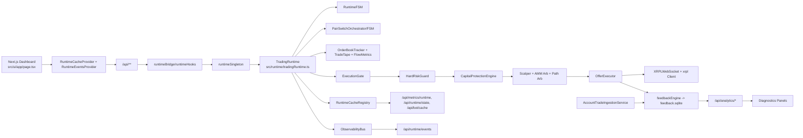

# XRPL Trading Bot

Institution-grade automated market-making and arbitrage runtime for XRPL with deterministic execution safety, localhost-only operations, and DB-backed diagnostics.

## 1) What It Does / Why It Exists

This repository runs a single-process trading system that combines:

- live XRPL market ingestion,
- strategy evaluation,
- deterministic execution gating,
- capital/risk controls,
- structured observability,
- and an operator dashboard.

It exists to reduce operational and execution risk in automated XRPL trading by making runtime behavior explicit, auditable, and fail-safe by default.

Design principles:

- deterministic gating before any ledger action,
- safety-first defaults (block when uncertain),
- pair-scoped state isolation,
- forensic observability (event stream + persistent analytics),
- localhost-only control plane.

## 2) Key Features + Constraints

### Architecture Constraints

| Constraint | Current Code Reality |
|---|---|
| Single process runtime | `TradingRuntime`, Next.js UI, and API routes run in one Node process (scripts force `SINGLE_PROCESS_MODE=true`). |
| Localhost-first execution | `server.js` binds `127.0.0.1`; runtime/startup enforce local-only checks; API routes enforce local request checks via `withLocalApi` (except App Router route `/api/bot/cache`). |
| Deterministic risk gating | Tick path uses `ExecutionGate` -> `HardRiskGuard` -> `CapitalProtectionEngine` before strategy execution/submit path. |
| DB-backed analytics | `feedback.sqlite` stores trade, snapshot, execution quality, and edge attribution events with indexes and dedupe constraints. |
| Pair-scoped state | Pair switch orchestrator + cache resets prevent cross-pair contamination. |

### Safety Constraints

| Constraint | Current Code Reality |
|---|---|
| XRPL transactions are irreversible | `OfferCreate`, `OfferCancel`, `TrustSet` results are final after validation. |
| Mainnet live trading requires explicit acknowledgement | `enforceSafetyPolicy()` blocks mainnet live trading unless `MAINNET_LIVE_TRADING_ACK=true` or lock file exists. |
| Unhealthy runtime blocks execution | Gate/risk checks block execution on feed, health, state, staleness, or risk violations. |
| Remote exposure is dangerous | `BOT_ALLOW_REMOTE=true` bypasses local-only protections and is explicitly unsafe. |

### Explicit Non-Wired / Scaffolded Areas

- `src/execution/qualityGate.ts` decision engine exists, but full per-order gate integration is **Not implemented in live trading behavior**.
- `src/execution/repricePolicy.ts` exists and is tested, but runtime wiring is **Not implemented in live trading behavior**.
- `src/xrpl/signer.ts` contains Xumm/Ledger/KMS scaffold signers that throw `SignerNotImplementedError`; these signers are **Not implemented in live trading behavior**.
- Runtime currently uses `src/xrpl/wallet.ts` credential loading path (seed/secret numbers, including encrypted mainnet secret support), not signer abstraction submission path.

## 3) Quick Start (Copy/Paste)

### Prerequisites

- Node.js `>=20`
- npm
- XRPL WebSocket access (`testnet` recommended first)
- Optional testnet wallet funding: `npm run faucet`

### Install

```bash
git clone <repo-url>
cd xrpl-trading-bot
npm install
```

### Minimal Safe `.env` (testnet + paper mode)

```bash
XRPL_NETWORK=testnet
XRPL_WSS_URL=wss://s.altnet.rippletest.net:51233
PAPER_TRADING=true
BOT_LOCAL_ONLY=true
```

Optional for testnet live execution:

```bash
PAPER_TRADING=false
XRPL_SEED_TESTNET=sEd...your-testnet-seed
```

### Run

```bash
npm run dev
```

Dashboard:

- `http://127.0.0.1:3000`

## 4) Configuration

Configuration is loaded in `src/config/index.ts` from `.env` in project root/CWD.

### Required / High-Impact Variables

| Variable | Default | Notes |
|---|---|---|
| `XRPL_NETWORK` | `mainnet` | Set `testnet` for initial validation. |
| `XRPL_WSS_URL` | `wss://s1.ripple.com` | Override endpoint; testnet example above. |
| `PAPER_TRADING` | `true` | Keep `true` until go-live criteria are met. |
| `BOT_LOCAL_ONLY` | unset | Required in production safety policy unless remote override is intentionally set. |
| `TRADE_BASE_CURRENCY` | `XRP` | Active pair base. |
| `TRADE_QUOTE_CURRENCY` | `NZD` | Active pair quote. |
| `POSITION_SIZE_XRP` | `5` | Strategy base position size. |
| `MAX_TRADE_SIZE` | `1000` | Hard trade-size ceiling. |
| `MAX_DAILY_LOSS_XRP` | `500` | Daily loss stop level. |
| `RESERVE_FLOOR_XRP` | `25` | Balance reserve gate in risk engine. |

### Safety / Security Variables

| Variable | Default | Effect |
|---|---|---|
| `MAINNET_LIVE_TRADING_ACK` | unset | Must be `true` for mainnet + live (`PAPER_TRADING=false`) unless lock file exists. |
| `SAFETY_LOCK_FILE` | `data/.mainnet-live-ack` | Lock-file path accepted by safety policy. |
| `BOT_ALLOW_REMOTE` | `false` | Dangerous override; bypasses local-only protections. |
| `LOCAL_API_TOKEN` | unset | Optional token for `withLocalApi` routes (`x-local-api-token` or Bearer token). |
| `SAFETY_SKIP_MAINNET_ACK` | `false` | Test-only bypass. |
| `SAFETY_SKIP_REMOTE_POLICY` | `false` | Test-only bypass. |

### Hard Risk Drawdown Confidence Variables

| Variable | Default | Effect |
|---|---|---|
| `HARD_RISK_MAX_DRAWDOWN_PCT` | `7` | Drawdown threshold. |
| `HARD_RISK_MIN_TRADES_FOR_DRAWDOWN` | `50` | Minimum trades before drawdown can hard-block. |
| `HARD_RISK_MIN_PEAK_EQUITY` | `1.0` | Minimum peak equity before drawdown can hard-block. |

### Strategy / Flow Variables

| Variable | Default | Effect |
|---|---|---|
| `MIN_SPREAD_BPS` | `10` | Scalper spread floor. |
| `AMM_ARB_MIN_PROFIT_BPS` | `15` | AMM arb minimum expected edge. |
| `PATH_ARB_ENABLED` | `false` | Path arb disabled by default. |
| `PATH_ARB_DRY_RUN` | `true` | When enabled, default path arb mode is dry-run. |
| `VOL_STOP_ENABLED` | `false` | Enables volatility-adaptive stop-loss for scalper exits (default off = legacy fixed stops). |
| `FLOW_ENABLE_REGIME_FILTER` | `true` | Strategy gating by regime. |
| `FLOW_ENABLE_ADVERSE_SELECTION` | `true` | Adverse-selection protection. |

### Volatility-Adaptive Stops (Optional)

When `VOL_STOP_ENABLED=true`, scalper stop-loss bps are derived from EWMA mid-price volatility:

- warmup phase: fixed `STOP_LOSS_BPS` is used until `VOL_STOP_MIN_SAMPLES` or `VOL_STOP_WARMUP_MS` is reached,
- adaptive phase: `VOL_STOP_MULTIPLIER * volBps`, clamped to `[VOL_STOP_MIN_BPS, VOL_STOP_MAX_BPS]`,
- enhanced stop in downtrend remains half-stop behavior, using adaptive stop unless `VOL_STOP_USE_FOR_ENHANCED=false`.

Default is off, so existing stop-loss behavior is unchanged.

### Observability / API Caching Variables

| Variable | Default | Effect |
|---|---|---|
| `ANALYTICS_CACHE_TTL_MS` | `5000` | TTL cache for heavy analytics routes. |
| `EVENT_LOOP_LAG_LIMIT_MS` | `100` | Auto-pause threshold for event loop lag tracker. |
| `CPU_MAX_PERCENT` | `50` | CPU watchdog threshold. |
| `CPU_MAX_DURATION_MS` | `5000` | Sustained CPU duration before pause. |

### Dangerous Flags Warning

Do not use these in production unless fully understood:

- `BOT_ALLOW_REMOTE=true`
- `SAFETY_SKIP_MAINNET_ACK=true`
- `SAFETY_SKIP_REMOTE_POLICY=true`
- `SIGNER_SKIP_READY_CHECK=true` (only relevant if you wire signer abstraction)

## 5) How To Use

### Start Bot

```bash
curl -X POST http://127.0.0.1:3000/api/bot/run
```

### Pause Bot

```bash
curl -X POST http://127.0.0.1:3000/api/bot/pause
```

### Kill Bot

```bash
curl -X POST http://127.0.0.1:3000/api/bot/kill
```

Notes:

- `kill` uses runtime `kill()` path (hard stop).
- graceful shutdown with open-offer cancellation happens via process signal handling (`SIGTERM`/`SIGINT`) and runtime `shutdown()`.

### Switch Trading Pair

```bash
curl -X POST http://127.0.0.1:3000/api/bot/trading-pair \
  -H 'Content-Type: application/json' \
  -d '{"pairKey":"XRP/RLUSD"}'
```

### View Diagnostics

Open dashboard and select `Diagnostics` tab.

Current diagnostics sections:

- Execution: `ExecutionQualityPanel`, `EdgeAttributionPanel`
- Risk: `RiskStressPanel`, `GovernancePanel`
- Policy: `RegimeHeatmapPanel`, `AdaptivePanel`

### Health Checks

```bash
curl http://127.0.0.1:3000/api/health
curl http://127.0.0.1:3000/api/runtime/state
curl http://127.0.0.1:3000/api/metrics/runtime
curl http://127.0.0.1:3000/api/runtime/events?limit=50
```

## 6) Architecture Overview

### Mermaid (Current Runtime Wiring)



### Subsystem Map

| Subsystem | Path | Responsibility |
|---|---|---|
| Custom server | `server.js` | Starts Next.js on `127.0.0.1`, cloud detection, proxy-header stripping. |
| Runtime core | `src/runtime/tradingRuntime.ts` | Tick orchestration, subsystem wiring, lifecycle control. |
| Lifecycle FSM | `src/runtime/runtimeFsm.ts` | 8-state runtime lifecycle and execution readiness gating. |
| Pair switch FSM | `src/runtime/pairSwitchFsm.ts`, `src/runtime/pairSwitchOrchestrator.ts` | 12-phase pair switch and context isolation. |
| Runtime cache | `src/runtime/runtimeCacheRegistry.ts` | Pair-scoped snapshot source for UI/API; includes strategy funnel and spread distribution. |
| Execution gate | `src/execution/executionGate.ts` | ALLOW/BLOCK verdict before strategy execution. |
| Hard risk | `src/risk/hardRiskGuard.ts` | Deterministic risk block/warn with drawdown-confidence gating. |
| Capital protection | `src/risk/capitalProtection.ts` | ALLOW/THROTTLE/PAUSE/SHUTDOWN governance mode. |
| Offer execution | `src/execution/offerExecutor.ts` | Offer create/cancel path, trace, analytics writes, submit telemetry sink. |
| Market ingestion | `src/market/orderBookTracker.ts`, `src/market/tradeTape.ts` | Order book + trade tape updates. |
| Flow regime engine | `src/market/flowMetrics.ts` | Regime classification: `quiet`, `normal`, `trendingUp`, `trendingDown`, `chaotic`, `illiquid`. |
| XRPL client | `src/xrpl/client.ts`, `src/xrpl/sharedClient.ts` | WebSocket client lifecycle and reconnect behavior. |
| Wallet credentials | `src/xrpl/wallet.ts` | Seed/secret-number loading, encrypted mainnet secret support. |
| Persistence (instruments) | `src/market/instrumentRegistry/db.ts` | Instrument/issuer registry in SQLite with seed bootstrapping. |
| Persistence (exposure) | `src/persistence/exposureStore.ts` | Durable exposure fills/state in SQLite. |
| Persistence (breaker) | `src/persistence/breakerStore.ts` | Redis/file breaker state store for path arb circuit breaker. |
| Analytics DB | `src/analytics/feedbackDb.ts` | `feedback.sqlite` schema, indexes, query helpers, retention. |
| Analytics engine | `src/analytics/feedbackEngine.ts` | Aggregations for diagnostics/governance/adaptive policy. |
| Diagnostics UI | `src/ui/components/*Panel.tsx` | Operator panels (execution/risk/policy/scanner/order/tape/logs). |
| Local API middleware | `src/ui/lib/localApi/withLocalApi.ts` | Localhost checks, optional token auth, request ID, audit logging. |

## 7) Runtime Execution Path (Code-Accurate)

Per tick (`TradingRuntime.tick()`), the live path is:

1. risk daily reset + reserve check,
2. order book refresh + snapshot normalization/validation,
3. feed stall recovery checks,
4. market health quorum,
5. `ExecutionGate` (block if runtime/health/connectivity/pair-switch/staleness invalid),
6. flow metrics + liquidity + cache update,
7. feedback snapshot write,
8. `HardRiskGuard` evaluate,
9. `CapitalProtectionEngine` evaluate,
10. strategy loop (with regime/adaptive/governance overlays),
11. `OfferExecutor` submit/cancel path.

When blocked by gate/risk/capital protection, strategy execution is skipped; runtime cache still updates for observability.

## 8) UI Structure (Current)

Main dashboard (`src/ui/app/page.tsx`) currently renders:

- Status strip (runtime/risk/scanner book health chips)
- Primary panel: `FlowMetricsPanel`
- Market quality summary card
- Tool tabs:
  - `Order Book` -> `OrderBookPanel`
  - `Tape` -> `TradeTapePanel`
  - `Scanner` -> `ScannerPanel`
  - `Diagnostics` -> execution/risk/policy sections
- Activity drawer tabs:
  - `Orders` -> `BotOrdersPanel`
  - `Logs` -> `LogsPanel`
- Trade toasts via `AppShell` + `ToastContainer`

Diagnostics polling is visibility-gated via `enabled={diagnosticsVisible}` for heavy panels.

## 9) Safety + Security Notes

### Irreversible Trading Actions

Ledger actions are final after XRPL validation. Test on testnet before any live mainnet operation.

### Mainnet Lock / Safety Policy

`enforceSafetyPolicy()` runs at runtime start and can block startup for unsafe configs.

### Localhost Enforcement Layers

1. `server.js` binds to `127.0.0.1`
2. `src/security/localOnly.ts` enforcement in runtime constructor/start
3. `src/ui/lib/security/localOnly.ts` checks in runtime hook bootstrap/bot controller
4. `withLocalApi` on most Pages Router API routes

### API Auth Reality

- Implemented: localhost request checks + optional `LOCAL_API_TOKEN`.
- Not implemented: HMAC/RBAC auth layers.
- `BOT_API_ALLOWED_ORIGINS` CORS helper exists but is **Not implemented in live trading behavior** as a route-level enforcement layer.
- App Router route `/api/bot/cache` is not wrapped by `withLocalApi`; security depends on local server binding and local runtime deployment model.

### Signer / Secrets Reality

- Runtime currently uses `wallet.ts` credential loading path.
- `signer.ts` non-seed signers are scaffold-only and **Not implemented in live trading behavior**.
- Encrypted mainnet secret inputs are supported via `secretBox` and passphrase prompt flow.

## 10) Persistence Reality

| Store | Default Path | Usage |
|---|---|---|
| Instrument registry DB | `data/instruments.sqlite` | Instrument + issuer catalog (auto-seeded if empty). |
| Exposure DB | `data/exposure.sqlite` | `exposure_fills`, `exposure_state` durable exposure tracking. |
| Feedback DB | `data/feedback.sqlite` | Trade/snapshot/execution-quality/edge-attribution analytics tables. |
| Breaker file store (fallback) | `data/breaker_*.json` | Path-arb circuit breaker state when Redis not used. |
| Adaptive state | `data/adaptive-state.json` | Adaptive learner persisted tuning state. |
| Regime policy state | `data/regime-policy.json`, `data/regime-smoothed.json` | Regime policy persisted state. |
| Trade history file | `trade_history.json` | Web/API trade history feed (`/api/bot/trades`). |

Feedback DB includes:

- analytics query indexes,
- composite filter indexes,
- partial unique indexes for non-null `txHash` on execution quality and edge attribution,
- `INSERT OR IGNORE` dedupe behavior on those event tables.

## 11) Observability + Diagnostics

### Runtime Observability

- `ObservabilityBus` emits structured runtime events (`FSM_TRANSITION`, gate/risk/feed events, strategy funnel events, submit events, order placed/filled events, scanner events, etc.).
- `/api/runtime/events` supports recent, incremental (`afterSeq`), type/pair, and time-range retrieval.
- `PerfTracer`, CPU watchdog, and event-loop lag tracker run continuously and can suppress tick execution under infrastructure stress.

### Strategy Decision Funnel Metrics

Per strategy funnel counters are maintained in runtime cache:

- `strategyTicks`
- `candidatesBuilt`
- `rejectedCount` + `rejectedByReason`
- `approvedCount`
- `submitAttemptCount`, `submitSuccessCount`, `submitFailCount`
- `lastSubmitError`, `lastTxHash`

These are exposed through runtime cache snapshots (`/api/metrics/runtime` payload data).

### Execution Quality Dashboard

- Panel: `src/ui/components/ExecutionQualityPanel.tsx`
- API: `GET /api/analytics/execution-quality`
- Storage: `execution_quality_events` in `feedback.sqlite`
- Filters: `pairKey`, `pair`, `sinceMs`, `window` (legacy fallback), `strategy`, `side`, `source`, `bucketMs`
- Response keys: `summary`, `series`, `histograms`, `breakdowns`, `anomalies`, `filters`

### Edge Attribution Dashboard

- Panel: `src/ui/components/EdgeAttributionPanel.tsx`
- API: `GET /api/analytics/edge-attribution`
- Storage: `edge_attribution_events` in `feedback.sqlite`
- Filters: `pairKey`, `pair`, `sinceMs`, `strategy`, `side`, `source`, `bucketMs`
- Response keys: `summary`, `series`, `histograms`, `breakdowns`, `topTrades`, `filters`

### Data Integrity Notes

- Pair alias canonicalization supports human and XRPL-hex pair keys in analytics filters.
- Ingestion fallback writes in `AccountTradeIngestionService` are dedupe-guarded via `txHash` existence checks + DB unique indexes.

## 12) API Overview

### Core Runtime / Health

| Route | Method | Purpose |
|---|---|---|
| `/api/health` | `GET` | Readiness/uptime/network status; returns `503` if bot is running but XRPL disconnected. |
| `/api/runtime/state` | `GET` | Full runtime public state + telemetry envelope. |
| `/api/runtime/events` | `GET` | Structured observability event stream with filters/incremental polling. |
| `/api/metrics/runtime` | `GET` | Full runtime cache snapshot (pair payload wrapper). |
| `/api/metrics` | `GET` | Prometheus metrics text output. |

### Bot Control

| Route | Method | Purpose |
|---|---|---|
| `/api/bot/run` | `POST` | Start runtime loop (idempotent if already running). |
| `/api/bot/pause` | `POST` | Pause tick loop. |
| `/api/bot/kill` | `POST` | Hard stop runtime. |
| `/api/bot/status` | `GET` | Current bot controller state. |
| `/api/bot/trading-pair` | `POST` | Trigger pair switch FSM to new instrument key. |
| `/api/bot/risk` | `GET` | Risk + hard-risk payload + exposure snapshot. |

### Analytics (Diagnostics)

| Route | Method | Notes |
|---|---|---|
| `/api/analytics/execution-quality` | `GET` | DB-backed execution quality diagnostics with filterable buckets/histograms. |
| `/api/analytics/edge-attribution` | `GET` | DB-backed edge attribution diagnostics with top-trade slices. |
| `/api/analytics/summary` | `GET` | PnL/win-rate/drawdown summary and regime/strategy breakdowns. |
| `/api/analytics/adverse-selection-rate` | `GET` | Rolling adverse selection rate from snapshot stream. |
| `/api/analytics/governance/state` | `GET` | Capital protection mode, metrics, thresholds. |
| `/api/analytics/regimes/heatmap` | `GET` | Regime heatmap data; cached. |
| `/api/analytics/regimes/policy` | `GET` | Current persisted regime policy. |
| `/api/analytics/regimes/recompute` | `POST` | Force regime policy recompute + analytics cache invalidation. |
| `/api/analytics/adaptive/state` | `GET` | Adaptive tuning state snapshot. |
| `/api/analytics/adaptive/toggle` | `POST` | Enable/disable adaptive learning. |
| `/api/analytics/adaptive/recompute` | `POST` | Trigger adaptive recompute + analytics cache invalidation. |
| `/api/analytics/adaptive/explain` | `GET` | Human-readable adaptive tuning explanation. |

## 13) Testing

### Local Test Commands

```bash
npm test -- --run
npx tsc --noEmit -p tsconfig.json
npx tsc --noEmit -p tsconfig.web.json
npm run build
```

### Notable Suites / Coverage Areas

- runtime lifecycle, pair switch, shutdown behavior
- hard risk guard logic (including drawdown-confidence behavior)
- analytics API contracts (`execution-quality`, `edge-attribution`, `summary`, `adverse-selection-rate`)
- analytics cache invalidation on recompute endpoints
- strategy funnel/submit telemetry coverage
- UI polling dedup behavior tests in app layer

### CI (`.github/workflows/ci.yml`)

Jobs:

1. `lint-and-typecheck`
2. `test` (with test-count regression gate `>= 890`)
3. `build`

Note: lint step currently runs with `continue-on-error: true` in CI workflow.

## 14) Deployment / Production Readiness

### Mainnet Go-Live Checklist

- [ ] 72h testnet paper run with stable runtime telemetry
- [ ] 24h testnet live execution run with fill verification
- [ ] hard risk + governance states observed and understood
- [ ] pair switch runbook tested on active runtime
- [ ] graceful shutdown tested (open-offer cancellation path)
- [ ] `BOT_LOCAL_ONLY=true` and `BOT_ALLOW_REMOTE=false`
- [ ] mainnet acknowledgement configured (`MAINNET_LIVE_TRADING_ACK=true` or lock file)
- [ ] persistence paths writable (`data/` DB + JSON files)
- [ ] `/api/health`, `/api/runtime/state`, `/api/runtime/events` monitored
- [ ] `npm run build` and `npm test -- --run` green

### Signer Readiness Note (Important)

If your production requirement is external signing (KMS/Ledger/Xumm), integration work is still required in runtime submit path. Current external signer classes are scaffold-only and **Not implemented in live trading behavior**.

## 15) Failure Modes + Runbooks

### Feed Stall / Data Staleness

Symptoms:

- execution blocked with feed/health/staleness reasons,
- runtime transitions to `DEGRADED`/`RECOVERING`,
- `FEED_STALE` events.

Automatic response:

- staged `FeedStallRecovery` escalation,
- execution gate blocks until healthy.

Manual checks:

```bash
curl http://127.0.0.1:3000/api/runtime/state
curl "http://127.0.0.1:3000/api/runtime/events?limit=200"
```

### XRPL Disconnect

Symptoms:

- `/api/health` returns `ok: false` while running,
- `XRPL_DISCONNECTED` events.

Automatic response:

- XRPL reconnect logic + feed recovery + gate block.

### Risk Shutdown / Hard Risk Block

Symptoms:

- `/api/bot/risk` hard risk state `BLOCKED` or governance mode `PAUSE`/`SHUTDOWN`.

Action:

- inspect hard risk reasons and governance metrics,
- correct upstream conditions (balances, exposure, health, drawdown confidence inputs).

### CPU/Event Loop Overload

Symptoms:

- ticks skipped due to CPU watchdog or event loop lag auto-pause.

Action:

- inspect `/api/metrics/runtime` telemetry and runtime events,
- reduce load/increase headroom, then verify auto-recovery.

### Exposure Mismatch

Symptoms:

- runtime exposure differs from expected wallet state.

Action:

- pause bot,
- inspect `/api/runtime/balances`, `/api/bot/risk`, and exposure tables in `exposure.sqlite`,
- reconcile before resuming.

### Flow Panel Shows `illiquid`

This is expected when flow engine sees insufficient recent trades and/or depth (`FlowMetrics` thresholds). In that regime, strategies may be filtered or conservative by design.

## 16) Contributing

### PR Safety Checklist

- [ ] Do not weaken `ExecutionGate`, `HardRiskGuard`, `CapitalProtection`, safety policy, or localhost-only enforcement unless explicitly requested.
- [ ] Preserve pair-scoped state isolation.
- [ ] Route all trading actions through `OfferExecutor`.
- [ ] Add tests for any risk/execution/analytics behavior changes.
- [ ] Ensure new API routes use local-only protections (`withLocalApi` for Pages Router routes).
- [ ] Keep runtime loop non-blocking; background tasks must be cancellable/idempotent.
- [ ] Update README/config docs when env vars or operator workflows change.

### Code Conventions

- TypeScript strict, avoid `any`.
- Keep side effects at boundaries.
- Use structured logs/events for state changes.
- Client components must use `src/ui/lib/instruments.ts` (not server-side instrument registry modules).

### Adding a Strategy

1. Implement `Strategy` interface in `src/strategies/`.
2. Register strategy in `TradingRuntime.start()` strategy list.
3. Ensure decisions go through `OfferExecutor`.
4. Add strategy tests and rejection-reason telemetry coverage.
5. Document config gates and risk profile.

## License

License information not yet defined in this repository. Add project license before production distribution.

## Support / Issues

When filing an issue, include:

- exact timestamp/timezone and environment (`testnet/mainnet`, paper/live),
- active pair and bot state,
- relevant endpoint outputs:
  - `/api/health`
  - `/api/runtime/state`
  - `/api/runtime/events?limit=200`
  - `/api/bot/risk`
- recent logs from `/api/bot/logs`,
- reproduction steps and expected vs actual behavior.

## Appendix: Example Diagnostics Calls

```bash
curl "http://127.0.0.1:3000/api/analytics/execution-quality?pairKey=XRP/RLUSD&bucketMs=60000"
curl "http://127.0.0.1:3000/api/analytics/edge-attribution?pairKey=XRP/RLUSD&bucketMs=60000"
curl "http://127.0.0.1:3000/api/analytics/summary?pair=XRP/RLUSD"
```

## Appendix: Build / Verification

```bash
npm run build:backend
npm run build:frontend
npm run build
npm test -- --run
```
