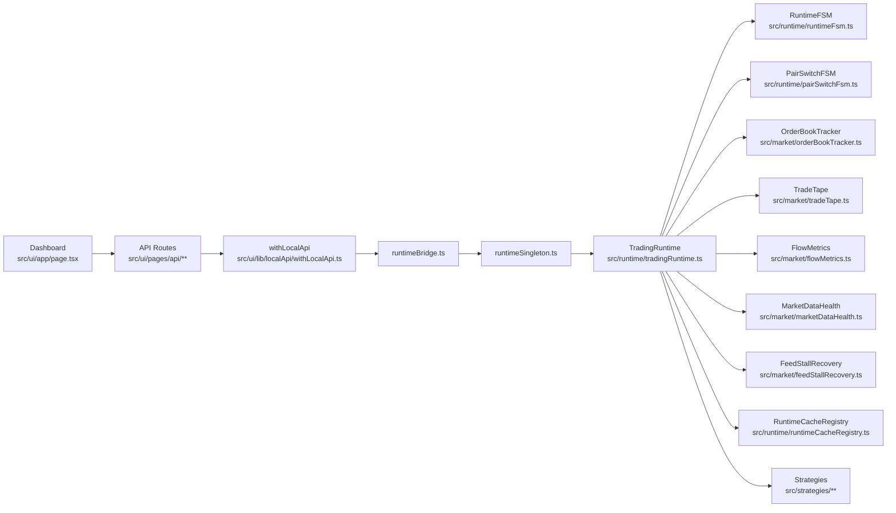
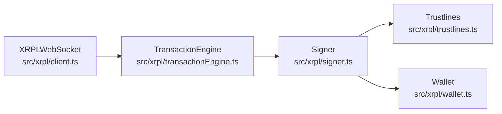

# XRPL Trading Bot

A single-process, institution-grade automated market-making and arbitrage engine for the XRP Ledger. The bot connects to an XRPL node via WebSocket, refreshes order books, runs three concurrent strategies (scalper, AMM arbitrage, path arbitrage), and executes offers through a multi-layered risk/execution pipeline — all behind a localhost-only Next.js dashboard with full lifecycle control.

This document is operational infrastructure documentation for pre-mainnet go-live. It describes the concrete directory structure, module responsibilities, safety controls, failure modes, and runbook procedures as they exist in the codebase today.

---

## ⚠ Safety Warning — Real Funds at Risk

This bot signs and submits transactions to the XRP Ledger. On mainnet, every `OfferCreate`, `OfferCancel`, and `TrustSet` transaction is final and irreversible once validated by consensus.

**Before running on mainnet:**

1. Complete every item in the [Mainnet Go-Live Checklist](#mainnet-go-live-checklist).
2. Run for a minimum of 72 hours on testnet in paper-trading mode.
3. Run for a minimum of 24 hours on testnet with live execution.
4. Set `MAINNET_LIVE_TRADING_ACK=true` or create the lock file `data/.mainnet-live-ack` — without this, the runtime will refuse to start.
5. Never set `BOT_ALLOW_REMOTE=true` on mainnet unless you fully understand that it exposes your wallet seed to the network.

---

## System Goals

| Quality | Implementation |
|---|---|
| **Deterministic execution** | Order placement is gated by `ExecutionGate` → `HardRiskGuard` → `CapitalProtectionEngine` before reaching the ledger. `QualityGate`/`RepricePolicy` logic exists but is **not implemented in live trading behavior** (not wired into the execution path). |
| **Fail-safe by default** | If any data feed stalls, health score drops, or risk limit is breached, execution is blocked automatically. The system must be explicitly healthy to trade. |
| **Localhost-only security** | The bot binds to `127.0.0.1`, rejects proxy headers, blocks cloud platforms at startup, and requires `BOT_LOCAL_ONLY=true` in production. |
| **Observable** | Structured event bus (`ObservabilityBus`), per-tick performance tracing (`PerfTracer`), event loop lag monitoring, and a full-featured Next.js dashboard. |
| **Durable** | Exposure state and circuit-breaker state persist to SQLite. Adaptive learning state persists to JSON on disk. Process restart rehydrates from durable storage. |
| **Single-process** | The trading runtime, Next.js dashboard, and API routes run in one Node.js process. No dual-process rate-limit amplification against XRPL nodes. |

---

## Architecture Diagram

### Mermaid

GitHub renders large Mermaid diagrams too small; diagrams are split for readability.

Full diagram source: `docs/architecture-full.mmd` (export to SVG with `npx mmdc -i docs/architecture-full.mmd -o docs/architecture-full.svg`).

#### Runtime + Market Flow



#### Execution + Risk Pipeline

```mermaid
flowchart LR
    ExecutionGate["ExecutionGate<br/>src/execution/executionGate.ts"] --> HardRisk["HardRiskGuard<br/>src/risk/hardRiskGuard.ts"]
    HardRisk --> CapitalProtection["CapitalProtection<br/>src/risk/capitalProtection.ts"]
    CapitalProtection --> QualityGate["QualityGate (logic only)<br/>src/execution/qualityGate.ts"]
    QualityGate --> OfferBuilder["OfferBuilder<br/>src/execution/offerBuilder.ts"]
    OfferBuilder --> OfferExecutor["OfferExecutor<br/>src/execution/offerExecutor.ts"]
    OfferExecutor --> ExposureTracker["ExposureTracker<br/>src/risk/exposureTracker.ts"]
```



#### XRPL + Signing



### ASCII Fallback

```
┌──────────────────────────────────────────────────────────────────────┐
│                     UI (Next.js Dashboard)                           │
│  page.tsx → API Routes (pages/api/**) → withLocalApi middleware      │
└─────────────────────────┬────────────────────────────────────────────┘
                          │
                    runtimeBridge / runtimeHooks / botController
                          │
                    runtimeSingleton
                          │
┌─────────────────────────▼────────────────────────────────────────────┐
│                    TradingRuntime                                     │
│  ┌────────────┐  ┌────────────┐  ┌──────────────────────────────┐   │
│  │ RuntimeFSM │  │PairSwitch  │  │ CacheRegistry                │   │
│  │  (8-state) │  │FSM (12-st) │  │ (API snapshot source)        │   │
│  └────────────┘  └────────────┘  └──────────────────────────────┘   │
└──┬──────────┬──────────┬───────────┬──────────┬──────────┬──────────┘
   │          │          │           │          │          │
   ▼          ▼          ▼           ▼          ▼          ▼
┌──────┐  ┌───────┐  ┌───────┐  ┌───────┐  ┌──────┐  ┌───────────┐
│Market│  │Execut.│  │ Risk  │  │ XRPL  │  │Monit.│  │ Analytics │
│      │  │       │  │       │  │       │  │      │  │           │
│Regist│  │Gate   │  │HardRsk│  │Client │  │ELLag │  │ExecQual   │
│Router│  │Quality│  │CapProt│  │Signer │  │Perf  │  │Adaptive   │
│Avail.│  │Reprice│  │Exposur│  │TxEng  │  │CPU   │  │Feedback   │
│Trust │  │Trace  │  │RiskEng│  │Trust  │  │      │  │Slippage   │
│Liquid│  │Builder│  │       │  │Wallet │  │      │  │Regime     │
│Book  │  │       │  │       │  │       │  │      │  │           │
│Tape  │  │       │  │       │  │       │  │      │  │           │
│Flow  │  │       │  │       │  │       │  │      │  │           │
│Stall │  │       │  │       │  │       │  │      │  │           │
│Health│  │       │  │       │  │       │  │      │  │           │
└──┬───┘  └───────┘  └───┬───┘  └───────┘  └──────┘  └───────────┘
   │                     │
   ▼                     ▼
┌──────────────────────────────────────────┐
│          Persistence (SQLite)            │
│  instruments.sqlite  exposure.sqlite     │
│  feedback.sqlite     breaker (file/Redis)│
│  adaptive-state.json regime-policy.json  │
└──────────────────────────────────────────┘
```

---

## Subsystem Map

| Area | Path | Responsibility |
|---|---|---|
| **Entry point** | `src/index.ts` | Legacy CLI entry — prints deprecation warning and exits. Use `npm run dev` or `npm run start`. |
| **Server** | `server.js` | Custom Next.js HTTP server bound to `127.0.0.1`. Cloud-platform detection and localhost-only binding. |
| **Runtime core** | `src/runtime/tradingRuntime.ts` | Owns the tick loop, wires all subsystems, manages lifecycle. Central orchestrator. |
| **Runtime FSM** | `src/runtime/runtimeFsm.ts` | 8-state lifecycle FSM: `BOOTING` → `SYNCING_LEDGER` → `SUBSCRIBING_FEEDS` → `WARMING_MARKET_CACHE` → `READY` ↔ `DEGRADED` ↔ `RECOVERING` → `HALTED`. Only `READY` allows execution. |
| **Pair switch** | `src/runtime/pairSwitchFsm.ts`, `src/runtime/pairSwitchOrchestrator.ts` | 12-state pair-switch FSM ensuring zero cross-pair data mixing during live pair changes. |
| **Runtime singleton** | `src/runtime/runtimeSingleton.ts` | Process-global `TradingRuntime` instance shared between API routes and tick loop. |
| **Runtime observability** | `src/runtime/runtimeObservability.ts` | Aggregates telemetry from FSM, feeds, ledger, and balance snapshots into `RuntimeTelemetry`. |
| **Cache registry** | `src/runtime/runtimeCacheRegistry.ts` | Centralized per-tick cache snapshot — the single source of truth for all API routes. |
| **Instrument registry** | `src/market/instrumentRegistry/` | SQLite-backed instrument + issuer database. `schema.ts` (types + seed data), `registry.ts` (public API), `db.ts` (SQLite). Replaces the static `TRADING_PAIRS` array. |
| **Issuer router** | `src/market/issuerRouter.ts` | Tier-aware issuer resolution producing auditable `RoutingDecision` traces with fallback chains. |
| **Pair resolver** | `src/market/executionPairResolver.ts` | Centralizes issuer resolution into a single `resolve(pair)` → `ResolvedPair` call with XRPL-ready amount formatting. |
| **Availability scanner** | `src/market/availabilityScanner.ts` | Periodic on-ledger probes: issuer health (GlobalFreeze, RequireAuth), trustline presence, order-book depth. Produces availability verdicts. |
| **Trustline governance** | `src/market/trustlineGovernance.ts` | Pre-trade trustline validation, auto-ensure for registered issuers, tier-based limits, blacklist enforcement. |
| **Liquidity intelligence** | `src/market/liquidityIntelligence.ts` | Real-time liquidity scoring (0–100, grades A–F) from depth profile, spread stats, trade flow, and impact estimates. |
| **Order book** | `src/market/orderBookTracker.ts` | Polls XRPL `book_offers`, normalizes XRP drops vs. issued amounts, computes spread in bps. |
| **Trade tape** | `src/market/tradeTape.ts`, `src/market/tradeTapeService.ts` | Captures executed trades from the XRPL transaction stream; provides VWAP, aggression stats, and rolling windows. |
| **Flow metrics** | `src/market/flowMetrics.ts` | Classifies market into regimes: `TRENDING`, `MEAN_REVERTING`, `CHAOTIC`, `QUIET`, `ILLIQUID`. Drives strategy gating. |
| **Feed stall recovery** | `src/market/feedStallRecovery.ts` | 3-stage escalation: soft reconnect → hard resubscribe → full client rebuild. Cooperative with `ExecutionGate`. |
| **Market data health** | `src/market/marketDataHealth.ts` | Multi-signal health quorum (tape, book, ledger, balance). Produces a composite score (0–100). |
| **Snapshot validator** | `src/market/snapshotValidator.ts` | Structural validation: sequence gaps, timestamp regressions, NaN detection. |
| **Execution gate** | `src/execution/executionGate.ts` | ALLOW/BLOCK verdict integrating runtime FSM state, health score, connectivity, pair-switch phase, and risk shutdown. |
| **Quality gate** | `src/execution/qualityGate.ts` | Decision logic for ALLOW/DEFER/REPRICE/SKIP. **Not implemented in live trading behavior** (logic exists but not wired into strategy execution). |
| **Reprice policy** | `src/execution/repricePolicy.ts` | Reprice decision cascade logic. **Not implemented in live trading behavior** (helper is not invoked from runtime execution). |
| **Offer executor** | `src/execution/offerExecutor.ts` | Submits `OfferCreate`/`OfferCancel` transactions. Integrates governance size multiplier, adaptive overrides, and execution quality tracing. |
| **Offer builder** | `src/execution/offerBuilder.ts` | Constructs XRPL-formatted offer parameters from resolved pairs. |
| **Execution trace** | `src/execution/executionTrace.ts` | Per-trade correlation IDs and phase timestamps (decision → build → submit → ledgerAccepted → fill). |
| **Hard risk guard** | `src/risk/hardRiskGuard.ts` | 7-condition capital safety gate: exposure, skew, drawdown, FSM readiness, data validity, balance staleness, feed health. |
| **Risk engine** | `src/risk/riskEngine.ts` | Daily loss counter, consecutive failure kill-switch, reserve floor check, issuer blacklist, trade intent approval. |
| **Capital protection** | `src/risk/capitalProtection.ts` | Account-level governance: ALLOW / THROTTLE / PAUSE / SHUTDOWN modes with size multipliers, cooldowns, strategy/regime disabling. |
| **Exposure tracker** | `src/risk/exposureTracker.ts` | Net position, notional exposure, and inventory skew from fills. Persisted to SQLite via `src/persistence/exposureStore.ts`. |
| **Breaker store** | `src/persistence/breakerStore.ts` | Circuit-breaker state persistence — Redis (primary) or file-based (fallback). |
| **Exposure store** | `src/persistence/exposureStore.ts` | SQLite-backed durable position tracking: `exposure_fills` audit trail + `exposure_state` aggregate per pair. |
| **XRPL client** | `src/xrpl/client.ts` | `XRPLWebSocket` EventEmitter wrapping the xrpl.js `Client`. Manages subscriptions, reconnection with backoff, and order-book polling. |
| **Shared client** | `src/xrpl/sharedClient.ts` | Process-global `Client` singleton to prevent duplicate WebSocket connections. |
| **Signer** | `src/xrpl/signer.ts` | `SeedSigner` (testnet/dev only) plus Xumm/Ledger/KMS scaffolds that throw `SignerNotImplementedError`. Non-seed signers are **not implemented in live trading behavior** until SDKs are integrated. |
| **Transaction engine** | `src/xrpl/transactionEngine.ts` | Submits `OfferCreate`, `OfferCancel`, `TrustSet`, `Payment`, and `AccountSet` with retry and sequence caching. |
| **Trustline manager** | `src/xrpl/trustlines.ts` | Creates and verifies trustlines with blacklist enforcement. |
| **Wallet** | `src/xrpl/wallet.ts` | Wallet initialization — supports seed, secret numbers, and encrypted mainnet credentials. |
| **Observability bus** | `src/observability/eventBus.ts` | Ring-buffer event stream with 17 event types. Dedup-guarded, pair-scoped, forensic-replay-ready. |
| **Event loop lag** | `src/monitoring/eventLoopLag.ts` | `setTimeout` delta sampling with P50/P95/P99 tracking. Auto-pauses trading when P95 exceeds threshold. |
| **Perf tracer** | `src/monitoring/perfTracer.ts` | Per-tick phase timing (13 phases). Rolling histograms with p50/p95/p99. Sub-5µs overhead. |
| **CPU watchdog** | `src/monitoring/cpuWatchdog.ts` | Sustained CPU usage monitoring. Pauses tick processing when CPU exceeds configurable threshold. |
| **Execution quality** | `src/analytics/executionQuality.ts` | Per-fill tracing and aggregation: P50/P95 slippage, latency, maker fill ratio, replace ratio. |
| **Slippage attribution** | `src/analytics/slippageAttribution.ts` | Decomposes fill cost into spread, impact, timing delay, fee, and residual components. |
| **Adaptive learner** | `src/analytics/adaptiveLearner.ts` | Per-strategy/pair/regime performance scoring with bounded parameter adjustments. Persists to `data/adaptive-state.json`. |
| **Feedback engine** | `src/analytics/feedbackEngine.ts` | SQLite-backed trade event recording for rolling risk metrics (profit factor, win rate, drawdown, expectancy). |
| **Regime policy** | `src/analytics/regimePolicy.ts` | Per-strategy regime-specific size multipliers and disable gates. |
| **Strategies** | `src/strategies/scalper.ts`, `ammArbitrage.ts`, `pathArbitrage.ts` | Three strategy implementations conforming to the `Strategy` interface in `src/strategies/types.ts`. |
| **Config** | `src/config/index.ts` | `.env` loading, typed `AppConfig` construction with safe defaults. |
| **Trading pairs (legacy)** | `src/config/tradingPairs.ts` | Backward-compatible delegation layer. Delegates to `src/market/instrumentRegistry/`. New code should import from the registry directly. |
| **Security: local-only** | `src/security/localOnly.ts` | Cloud platform detection, container detection, localhost address validation. |
| **Security: safety policy** | `src/security/safetyPolicy.ts` | Startup enforcement: blocks remote access in production, requires mainnet live-trading acknowledgement, validates risk config. |
| **Security: secret box** | `src/security/secretBox.ts` | Encrypted mainnet secret storage (encrypt at rest, decrypt with passphrase). |
| **UI dashboard** | `src/ui/app/page.tsx` | Main React dashboard with panels for order book, trade tape, flow metrics, analytics, governance, and controls. |
| **UI components** | `src/ui/components/` | `OrderBookPanel`, `TradeTapePanel`, `FlowMetricsPanel`, `GovernancePanel`, `MarketDataHealthPanel`, `InstrumentSelector`, `ControlsPanel`, `AdaptivePanel`, `CostRealismPanel`, `RegimeHeatmapPanel`, etc. |
| **UI hooks** | `src/ui/lib/hooks/` | `useOrderBook`, `useTradeTape`, `useCandles`, `useFlowMetrics`, `useMarketHealth`, `useBalances`. |
| **UI API middleware** | `src/ui/lib/localApi/withLocalApi.ts` | Localhost-only + `requestId` injection + optional `LOCAL_API_TOKEN` validation + audit logging. |
| **Audit logging** | `src/ui/lib/localApi/audit.ts` | JSONL audit trail to `data/audit.log` with sensitive field redaction. |

---

## Documentation Coverage Audit

Docs coverage for required subsystems (based on live code paths):

| Subsystem | Primary entry files | What it does | Documented in README? | Insert heading if missing |
|---|---|---|---|---|
| Runtime lifecycle + FSM + pair switch FSM | `src/runtime/tradingRuntime.ts`, `src/runtime/runtimeFsm.ts`, `src/runtime/pairSwitchFsm.ts`, `src/runtime/pairSwitchOrchestrator.ts` | Manages lifecycle transitions, READY gating, and 12‑state pair isolation during pair changes. | YES | — |
| Execution pipeline (gate/quality/reprice/executor/builder) | `src/execution/executionGate.ts`, `src/execution/qualityGate.ts`, `src/execution/repricePolicy.ts`, `src/execution/offerExecutor.ts`, `src/execution/offerBuilder.ts` | Execution allow/block gating plus order build/submit helpers; quality/reprice logic exists but is not wired into live execution. | YES | — |
| Risk pipeline (hard guard / risk engine / capital protection / exposure) | `src/risk/hardRiskGuard.ts`, `src/risk/riskEngine.ts`, `src/risk/capitalProtection.ts`, `src/risk/exposureTracker.ts` | Deterministic capital safety gates, emergency shutdown, throttling, and exposure tracking with persistence. | YES | — |
| XRPL client + signer + tx engine + trustlines | `src/xrpl/client.ts`, `src/xrpl/signer.ts`, `src/xrpl/transactionEngine.ts`, `src/xrpl/trustlines.ts`, `src/xrpl/wallet.ts` | WebSocket connectivity, transaction submission, signing abstraction, and trustline management. | YES | — |
| Observability & monitoring | `src/observability/eventBus.ts`, `src/monitoring/perfTracer.ts`, `src/monitoring/eventLoopLag.ts`, `src/monitoring/cpuWatchdog.ts` | Structured event bus, perf tracing, lag and CPU watchdogs that can auto‑pause ticks. | YES | — |
| Persistence stores | `src/market/instrumentRegistry/db.ts`, `src/persistence/exposureStore.ts`, `src/persistence/breakerStore.ts`, `src/analytics/adaptiveLearner.ts`, `src/analytics/regimePolicy.ts` | SQLite registries/exposure DB, breaker store, and JSON state for adaptive/regime policy. | YES | — |
| UI + API routes + local-only middleware | `src/ui/app/page.tsx`, `src/ui/pages/api/**`, `src/ui/lib/localApi/withLocalApi.ts`, `src/ui/lib/security/localOnly.ts` | Dashboard UI, API routes, localhost enforcement, request IDs, audit logging, and optional token checks. | YES | — |
| Config/env validation + safety policy | `src/config/index.ts`, `src/security/safetyPolicy.ts`, `src/security/localOnly.ts` | Typed config loading, safety policy enforcement, and local-only gating. | YES | — |

### README Mismatches (fixed in this update)

- UI paths under `web/` no longer exist; the UI lives under `src/ui/` and the custom server is `server.js`.
- `.env.example` is referenced but not present in the repo; configuration references now point to code-backed defaults.
- HMAC/RBAC API auth was described but is not wired in the codebase; only localhost checks + optional `LOCAL_API_TOKEN` exist.
- `qualityGate.ts` and `repricePolicy.ts` contain logic but are not called from the runtime execution path (**Not implemented in live trading behavior**).
- Non-seed signers (Xumm/Ledger/KMS) throw `SignerNotImplementedError` until their SDKs are integrated (**Not implemented in live trading behavior**).

---

## How Execution Works End-to-End

Each tick of the trading loop (`TradingRuntime.tick()`) follows this data flow:

```
1.  Risk reset         →  checkAndResetDaily() — UTC midnight rollover
2.  Reserve check      →  checkReserves(wallet) — XRPL balance query
3.  Order book refresh →  OrderBookTracker.refresh() — XRPL book_offers RPC
4.  Snapshot normalize →  normalizeOrderBookSnapshot() + SnapshotValidator
5.  Feed stall check   →  FeedStallRecovery.evaluate() — staged reconnect
6.  Health quorum      →  computeMarketDataHealth() — tape/book/ledger/balance
7.  Execution gate     →  evaluateExecutionGate() — ALLOW or BLOCK verdict
8.  FSM transitions    →  READY ↔ DEGRADED based on health score
9.  Flow metrics       →  computeFlowMetrics() → regime classification
10. Liquidity intel    →  LiquidityIntelligence.ingestTick()
11. Cache update       →  RuntimeCacheRegistry.update() — API snapshot
12. Hard risk guard    →  7-condition capital safety gate
13. Capital protection →  ALLOW / THROTTLE / PAUSE / SHUTDOWN governance
14. Strategy loop      →  For each strategy (Scalper, AMM Arb, Path Arb):
    a. Regime policy gate → skip if regime disabled
    b. Adaptive tuning    → apply learned size/slippage/edge overrides
    c. Strategy.tick(ctx) → strategy decides and calls OfferExecutor
    d. Clear overrides    → prevent cross-strategy contamination
```

If the execution gate returns `BLOCK` at step 7, steps 8–14 are skipped for that tick. The cache is still updated so the dashboard reflects the latest state.

---

## Market Layer

### Instrument Registry (`src/market/instrumentRegistry/`)

The **single source of truth** for trading pair definitions. Backed by SQLite (`data/instruments.sqlite`) with an in-memory cache for hot-path lookups.

- **`schema.ts`** — Canonical types (`Instrument`, `IssuerRecord`, `CurrencySide`, `IssuerTier`) and the static `SEED_INSTRUMENTS` array (5 pairs: XRP/RLUSD, XRP/USDC, XRP/EUR, XRP/BTC, XRP/ETH).
- **`registry.ts`** — Public API: `getInstruments()`, `findInstrument()`, `getInstrument()`, `isValidPairKey()`, `listInstruments()`, `getActiveIssuersForCurrency()`. All functions go through `ensureCache()` which lazy-loads from SQLite.
- **`db.ts`** — SQLite operations: upsert/list/update/delete for both instruments and issuers. WAL mode, NORMAL synchronous.

> **Note:** `src/config/tradingPairs.ts` still exists for backward compatibility but delegates entirely to the instrument registry. New code should import from `src/market/instrumentRegistry/` directly.

### Issuer Routing (`src/market/issuerRouter.ts`)

Replaces the static `pair.quoteIssuer ?? pair.issuer` cascade with a deterministic, tier-aware resolution:

1. Explicit pair override (from `TradingPair.baseIssuer` / `quoteIssuer`)
2. Registry lookup by (currency, network) → ranked by `IssuerTier` (tier1 > tier2 > tier3 > untrusted)
3. Trustline availability check (if enabled)
4. Blacklist exclusion

Every resolution produces a `RoutingDecision` with confidence score, routing trace, and fallback chain.

### Availability Scanner (`src/market/availabilityScanner.ts`)

Periodic on-ledger probes (not every tick — configurable interval):

| Probe | What it checks | Verdict on failure |
|---|---|---|
| Issuer health | `account_info`: funded, GlobalFreeze, RequireAuth, DisableMaster, DefaultRipple | `BLOCKED` (frozen) or `DEGRADED` |
| Trustline | `account_lines`: bot holds trustline to issuer | `DEGRADED` |
| Order book | `book_offers`: non-empty bids AND asks | `UNAVAILABLE` (empty) or `DEGRADED` (one-sided) |

Composite verdict: `AVAILABLE` / `DEGRADED` / `UNAVAILABLE` / `BLOCKED` / `UNKNOWN`.

### Trustline Governance (`src/market/trustlineGovernance.ts`)

- Pre-trade gate: block execution if required trustlines are missing
- Auto-ensure: create trustlines for registered issuers on pair switch
- Tier-based limits: different trustline limits per issuer tier
- Blacklist enforcement: never create trustlines to blacklisted issuers
- Audit trail: all trustline decisions logged

---

## Execution Layer

### Execution Gate (`src/execution/executionGate.ts`)

The top-level ALLOW/BLOCK decision evaluated every tick before any strategy runs. Checks:

- Runtime FSM state (must be `READY`)
- Market data health score (must be ≥ `minHealthScore`, default 50)
- XRPL connectivity (must be connected, not reconnecting)
- Pair-switch phase (must be `READY`)
- Feed recovery state (must not be in recovery)
- Risk kill-switch (must not be triggered)
- Snapshot structural validity (from `SnapshotValidator`)
- Ledger and balance staleness

### Quality Gate (`src/execution/qualityGate.ts`)

Per-order micro-decision: ALLOW / DEFER / REPRICE / SKIP. Evaluates spread width, expected impact, feed staleness, volatility, depth notional, edge vs. cost, and urgency level.

### Reprice Policy (`src/execution/repricePolicy.ts`)

7-step cascade for resting order management:

1. **Hard staleness** → CANCEL immediately (feed too old)
2. **Churn breaker** → PAUSE (too many replaces per minute)
3. **Spread regime change** → REPLACE (market structure shifted)
4. **Queue deterioration** → REPLACE (order at risk)
5. **Soft staleness + drift** → REPLACE with urgency
6. **Drift above threshold** → REPLACE
7. **Within tolerance** → KEEP

### Execution Trace (`src/execution/executionTrace.ts`)

Correlation-ID-based tracing from decision to fill:

```
decision → build → submit → ledgerAccepted → fill
   │         │        │           │             │
   ├─ ts     ├─ ts    ├─ ts      ├─ ts         ├─ ts
   └─ mid    └─       └─         └─            ├─ fillPrice
                                                ├─ slippageBps
                                                ├─ spreadCostBps
                                                └─ impactProxyBps
```

### Slippage Attribution (`src/analytics/slippageAttribution.ts`)

Decomposes total slippage into:

- **Spread cost**: mid-to-fill price difference
- **Market impact**: post-fill mid shift
- **Timing delay**: decision-to-fill price drift
- **Fee cost**: on-ledger transaction fees
- **Residual**: unexplained cost

Feeds back into adaptive learning for strategy tuning.

---

## Risk Layer

### Hard Risk Guard (`src/risk/hardRiskGuard.ts`)

Deterministic 7-condition gate evaluated every tick before strategies run. **Any** condition breach blocks execution:

| # | Condition | Threshold source |
|---|---|---|
| 1 | Exposure limit exceeded | `HARD_RISK_MAX_EXPOSURE_NOTIONAL` env var |
| 2 | Inventory skew beyond threshold | Configurable skew limit |
| 3 | Max drawdown breached | Capital protection metrics |
| 4 | Runtime FSM not READY | `RuntimeFSM.getState()` |
| 5 | Market data invalid | `SnapshotValidator` |
| 6 | Balances stale | Last balance refresh age |
| 7 | Feed degraded | Market data health score |

Emits edge-detected events: `RISK_LIMIT_WARNING` (approaching 80%), `RISK_LIMIT_BLOCK` (breached), `RISK_LIMIT_RECOVERY` (recovered).

### Capital Protection (`src/risk/capitalProtection.ts`)

Account-level governance sitting above all strategies:

| Mode | Effect |
|---|---|
| `ALLOW` | Normal execution |
| `THROTTLE` | Reduced size multiplier + cooldown between trades |
| `PAUSE` | All strategies skipped |
| `SHUTDOWN` | Emergency halt — sets `emergencyShutdown` flag |

Inputs: profit factor, expectancy, drawdown, slippage, partial fill rate, win rate, consecutive failures (all from `FeedbackEngine`).

### Exposure Tracker (`src/risk/exposureTracker.ts`)

Tracks net position, notional exposure, and inventory skew from executed fills. Persisted to SQLite (`data/exposure.sqlite`) via `src/persistence/exposureStore.ts`:

- `exposure_fills` table: audit trail of every fill
- `exposure_state` table: current aggregate per pair key
- Rehydrated on startup and pair switch via `setPairKey()`
- Disable persistence with `EXPOSURE_PERSISTENCE=false`

### Risk Engine (`src/risk/riskEngine.ts`)

- Daily loss counter with UTC midnight reset
- Consecutive failure kill-switch
- Dynamic reserve floor check (accounts for owner count)
- Issuer blacklist enforcement
- Trade intent approval gate

---

## Signing & Wallet Model

See `src/xrpl/signer.ts` for the full implementation.

### Signer Implementations

| Signer | Status | Context |
|---|---|---|
| `SeedSigner` | **Production-ready (testnet)** | Blocked on mainnet/production — throws at construction. |
| `XummSigner` | Scaffold | Throws `SignerNotImplementedError` with install instructions for `xumm-sdk`. **Not implemented in live trading behavior.** |
| `LedgerSigner` | Scaffold | Throws `SignerNotImplementedError` with install instructions for `@ledgerhq/hw-transport-node-hid`. **Not implemented in live trading behavior.** |
| `KmsSigner` | Scaffold | Throws `SignerNotImplementedError` with install instructions for `@aws-sdk/client-kms`. **Not implemented in live trading behavior.** |

### Signer Readiness Check (`assertSignerReady()`)

Called during `TradingRuntime.start()`. 4-step validation:

1. `getReadinessReport()` — configuration check
2. `isReady()` — connectivity/state check
3. `getAddress()` — address derivation test
4. Dry-run signing (SeedSigner only) — signs a dummy self-Payment

Skip with `SIGNER_SKIP_READY_CHECK=true` (dangerous, for integration testing only).

### Mainnet Signer Selection

On mainnet (`XRPL_NETWORK=mainnet` or `NODE_ENV=production`), `createSignerFromEnv()` requires one of:

- `KMS_KEY_ID` → `KmsSigner`
- `XUMM_API_KEY` → `XummSigner`
- `LEDGER_ENABLED=true` → `LedgerSigner`

Seed-based signing is explicitly blocked for mainnet.

---

## Runtime Model

### Lifecycle FSM (`src/runtime/runtimeFsm.ts`)

8 states with enforced transition adjacency:

```
BOOTING → SYNCING_LEDGER → SUBSCRIBING_FEEDS → WARMING_MARKET_CACHE
                                                       │
                                                 ┌─────▼─────┐
                                                 │   READY    │ ◄── only state allowing execution
                                                 └─────┬──┬──┘
                                                       │  │
                                              ┌────────▼  ▼────────┐
                                              │  DEGRADED  ◄───►  RECOVERING  │
                                              └──────┬─────────────┬──────────┘
                                                     │             │
                                                     ▼             ▼
                                                  HALTED (terminal)
```

- `DEGRADED` ↔ `READY` toggles based on market data health score
- `RECOVERING` entered during feed stall recovery, exits to `DEGRADED` or `READY`
- `HALTED` is terminal — reached via `forceHalt()` or graceful shutdown

### Pair Switch FSM (`src/runtime/pairSwitchFsm.ts`)

12-state deterministic pair switching:

```
READY → FREEZE_EXECUTION → UNSUBSCRIBE_OLD_FEEDS → DESTROY_PAIR_CONTEXT
→ RESET_PAIR_METRICS_WINDOWS → CREATE_NEW_PAIR_CONTEXT → SUBSCRIBE_NEW_FEEDS
→ WAIT_FIRST_BOOK → WAIT_FIRST_TAPE → REFRESH_BALANCES → VALIDATE_DATA_TRUTH
→ READY  (or → FAILED on error)
```

Execution is ONLY allowed in the `READY` phase. Every non-READY phase produces structured events on the observability bus.

### Runtime Singleton (`src/runtime/runtimeSingleton.ts`)

The process-global `TradingRuntime` instance. When `SINGLE_PROCESS_MODE=true` (the only supported mode), Next.js API routes read state from this singleton instead of making independent XRPL connections.

### Graceful Shutdown

`TradingRuntime.shutdown()` — idempotent, LIFO strategy teardown:

1. Stop tick processing
2. Cancel all open offers (`account_offers` → cancel each)
3. Stop strategies in reverse initialization order
4. Flush and close exposure persistence
5. Close breaker store, feedback engine, adaptive scheduler
6. Disconnect XRPL client
7. Reset all runtime state

---

## Observability & Monitoring

### Event Bus (`src/observability/eventBus.ts`)

Ring-buffer event stream with 17 canonical event types:

| Event | Trigger |
|---|---|
| `FSM_TRANSITION` | Runtime lifecycle state change |
| `PAIR_SWITCH_START` | Pair switch initiated |
| `PAIR_SWITCH_READY` | Pair switch completed |
| `PAIR_SWITCH_FAILED` | Pair switch failed |
| `EXECUTION_BLOCKED` | Gate denied tick (edge-detected) |
| `EXECUTION_ALLOWED` | Gate allowed tick after prior block (edge-detected) |
| `FEED_STALE` | Feed stall detected |
| `FEED_RECOVERED` | Feed recovered from stall |
| `XRPL_RECONNECTED` | WebSocket reconnected |
| `XRPL_DISCONNECTED` | WebSocket disconnected |
| `RISK_BLOCK` | Hard risk guard blocked execution |
| `DATA_INVALIDATED` | Snapshot structural validation failed |
| `BALANCE_STALE` | Balance staleness detected |
| `BALANCE_REFRESHED` | Balance refreshed after staleness |
| `RESOLVER_CACHE_MISS` | Pair resolver had to re-resolve |
| `AVAILABILITY_SCAN_COMPLETE` | Availability scanner cycle finished |
| `TRUSTLINE_GOVERNANCE` | Trustline decision (create/block/skip) |

Each event carries: `seq`, `eventType`, `timestamp`, `pairKey`, `runtimeState`, `correlationId`, `detail`.

### Event Loop Lag Tracker (`src/monitoring/eventLoopLag.ts`)

- Samples via `setTimeout` delta technique every 500ms (configurable)
- Maintains rolling window (120 samples = 60s)
- Computes P50/P95/P99 lag
- **Auto-pauses trading** when P95 exceeds `EVENT_LOOP_LAG_LIMIT_MS` (default 100ms)
- Recovery hysteresis: requires 10 consecutive samples below threshold before resuming

### Performance Tracer (`src/monitoring/perfTracer.ts`)

- Traces 13 tick phases using `process.hrtime.bigint()` (sub-5µs overhead)
- Rolling histograms (200 ticks ≈ 13 min at 4s interval)
- Periodic `PERF_SUMMARY` log line with p50/p95/p99 per phase

Tick phases: `riskReset`, `reserveCheck`, `bookRefresh`, `snapshot`, `feedStall`, `healthQuorum`, `fsmTransitions`, `flowMetrics`, `cacheUpdate`, `feedbackRecord`, `hardRisk`, `capitalProtection`, `strategies`.

### CPU Watchdog (`src/monitoring/cpuWatchdog.ts`)

- Monitors sustained CPU usage
- Pauses tick processing when CPU exceeds `CPU_MAX_PERCENT` (default 50%) for `CPU_MAX_DURATION_MS` (default 5000ms)
- Wired into `TradingRuntime.tick()` — `isCpuHealthy()` check runs before strategy loop

### Dashboard Metrics Endpoints

| Endpoint | Data source |
|---|---|
| `GET /api/health` | Runtime state, XRPL connectivity, uptime, version |
| `GET /api/metrics` | Aggregated bot performance metrics |
| `GET /api/metrics/runtime` | Full `RuntimeTelemetry` snapshot |
| `GET /api/market/health` | Market data health quorum result |
| `GET /api/runtime/state` | FSM state + cache snapshot |
| `GET /api/runtime/events` | Observability bus event stream |
| `GET /api/runtime/balances` | Wallet balance snapshot |

---

## Diagnostics & Analytics

The dashboard includes a **Diagnostics** tab (`src/ui/app/page.tsx`) with DB-backed analytics panels.

### Execution Quality Dashboard

- Backed by `execution_quality_events` in `data/feedback.sqlite` (not in-memory only).
- Measures execution quality (slippage/spread/latency/fill quality) with:
  - time series
  - histograms
  - breakdown tables
  - anomaly counters
- Filter contract: `pairKey, sinceMs, strategy, side, source, bucketMs`
  - Legacy compatibility: `window` is accepted and mapped to `sinceMs`.
- Ingestion fallback writes execution-quality rows only when executor did not already persist the same `txHash`.

### True Edge Attribution Panel

- Backed by `edge_attribution_events` in `data/feedback.sqlite`.
- Decomposes edge into signal/execution/drift using sign-safe BUY/SELL formulas and PnL identity checks.
- Executor writes attribution on final fills; delayed horizon enrichment populates 1m/5m fields.
- Ingestion fallback writes attribution only if executor row is absent (dedupe by `txHash`).
- API response shape: `{ summary, series, histograms, breakdowns, topTrades }`.

### Pair Aliasing and Dedupe

- Pair filters accept human and hex aliases (`XRP/RLUSD` and `XRP/524C555344000000000000000000000000000000`).
- Backend canonicalizes pair keys internally, so alias queries return consistent counts.
- Duplicate lifecycle writes are dedupe-safe by `txHash` in executor/ingestion persistence paths.

---

## API Endpoints

### `GET /api/analytics/execution-quality`

- Filters:
  - `pairKey`
  - `sinceMs`
  - `strategy`
  - `side`
  - `source`
  - `bucketMs`
  - legacy: `window` (fallback to `sinceMs`)
- Response keys:
  - `summary` (fills/rejects/partials, avg slippage/spread/latency coverage)
  - `series` (bucketed time series)
  - `histograms` (`slippageBps`, `spreadBps`, `postTradeDriftBps`)
  - `breakdowns` (`byPair`, `byStrategy`, `bySide`, `byRegime`)
  - `anomalies` (suspicious slippage spikes, partial fill anomalies, quote/base integrity violations)
  - `filters` (resolved request filters)

### `GET /api/analytics/edge-attribution`

- Filters:
  - `pairKey`
  - `sinceMs`
  - `strategy`
  - `side`
  - `source`
  - `bucketMs`
- Response keys:
  - `summary` (coverage + average signal/execution/drift/pnl metrics)
  - `series` (bucketed attribution series)
  - `histograms` (`executionEdgeBps`, `driftBps`)
  - `breakdowns` (`byPair`, `byStrategy`, `bySide`, `byRegime`)
  - `topTrades` (`worstExecution`, `adverseSelection`)
  - `filters` (resolved request filters)

---

## API Reference

All API routes are wrapped with `withLocalApi` middleware (`src/ui/lib/localApi/withLocalApi.ts`):

- Rejects non-localhost requests (403)
- Rejects proxied requests (`X-Forwarded-For`, `X-Real-IP`)
- Optional `LOCAL_API_TOKEN` header validation
- Attaches `X-Request-ID` (UUID) to every response
- Audit logs to `data/audit.log` (JSONL)

### Bot Control (`src/ui/pages/api/bot/`)

| Route | Method | Behavior |
|---|---|---|
| `/api/bot/run` | POST | Start the trading runtime. Idempotent if already running. |
| `/api/bot/pause` | POST | Pause tick processing (monitoring continues). |
| `/api/bot/kill` | POST | Stop runtime and disconnect XRPL. |
| `/api/bot/status` | GET | Bot state (`RUNNING`/`PAUSED`/`STOPPED`), pair, paper mode. |
| `/api/bot/trading-pair` | GET/POST | Get or change the active trading pair. POST triggers 12-state pair switch. |
| `/api/bot/wallet` | GET | Wallet address (no secrets). |
| `/api/bot/price` | GET | Current mid price, best bid/ask, spread. |
| `/api/bot/risk` | GET | Risk status: exposure, daily loss, kill-switch, reserve floor. |
| `/api/bot/orders` | GET | Open offers from `account_offers`. |
| `/api/bot/trades` | GET | Recent trades from trade tape. |
| `/api/bot/flow` | GET | Current flow metrics and regime classification. |
| `/api/bot/logs` | GET | Recent log buffer entries. |
| `/api/bot/position-size` | POST | Update position size at runtime. |

### Pair Data (`src/ui/pages/api/pairs/`)

| Route | Method | Behavior |
|---|---|---|
| `/api/pairs` | GET | List all registered instruments with availability verdicts. |
| `/api/pairs/[key]/summary` | GET | Mid price, spread, last updated, network availability. |
| `/api/pairs/[key]/orderbook` | GET | Depth-limited order book (bids + asks). |
| `/api/pairs/[key]/trades` | GET | Recent trades for a pair from trade tape. |
| `/api/pairs/[key]/candles` | GET | OHLCV candle data for charting. |

### Analytics (`src/ui/pages/api/analytics/`)

| Route | Method | Behavior |
|---|---|---|
| `/api/analytics/summary` | GET | Aggregated P&L, win rate, trade count, drawdown. |
| `/api/analytics/costs` | GET | Cost realism breakdown (spread, impact, fees). |
| `/api/analytics/execution-quality` | GET | DB-backed diagnostics: `summary/series/histograms/breakdowns/anomalies` with filters (`pairKey,sinceMs,strategy,side,source,bucketMs`, plus `window` fallback). |
| `/api/analytics/edge-attribution` | GET | True edge attribution diagnostics: `summary/series/histograms/breakdowns/topTrades` with the same filters. |
| `/api/analytics/governance/state` | GET | Capital protection mode, metrics, and disabled strategies. |
| `/api/analytics/regimes/policy` | GET | Current regime policy (size multipliers, disabled regimes). |
| `/api/analytics/regimes/recompute` | POST | Force regime policy recomputation. |
| `/api/analytics/regimes/heatmap` | GET | Strategy × regime performance heatmap data. |
| `/api/analytics/adaptive/state` | GET | Adaptive learner state (tunings per strategy/pair/regime). |
| `/api/analytics/adaptive/toggle` | POST | Enable/disable adaptive learning. |
| `/api/analytics/adaptive/recompute` | POST | Force adaptive recomputation. |
| `/api/analytics/adaptive/explain` | GET | Human-readable explanation of current tuning decisions. |

### Runtime & Monitoring (`src/ui/pages/api/runtime/`, `src/ui/pages/api/metrics/`)

| Route | Method | Behavior |
|---|---|---|
| `/api/runtime/state` | GET | Full runtime FSM + cache snapshot. |
| `/api/runtime/events` | GET | Observability bus events (ring buffer). |
| `/api/runtime/balances` | GET | Wallet XRP + issued currency balances. |
| `/api/metrics` | GET | Aggregated performance metrics. |
| `/api/metrics/runtime` | GET | Full `RuntimeTelemetry` (FSM, feeds, ledger, balance, health, gate). |

### Trade Stream (`src/ui/pages/api/trades/`)

| Route | Method | Behavior |
|---|---|---|
| `/api/trades/tape` | GET | Full trade tape contents. |
| `/api/trades/stream` | GET | Streaming trade updates (SSE or polling). |

### Health (`src/ui/pages/api/`)

| Route | Method | Behavior |
|---|---|---|
| `/api/health` | GET | Readiness probe: bot state, XRPL connectivity, uptime. Returns 503 if running but disconnected. |
| `/api/market/health` | GET | Market data health quorum: composite score, per-signal breakdown. |

---

## Configuration & Environment Variables

Configuration is loaded in `src/config/index.ts` from `.env` files (project root and CWD). This repo does not include a `.env.example`, so the tables below and the module config loaders are the authoritative source of defaults.

Safety validation is enforced by `src/security/safetyPolicy.ts` at startup. Signer selection is enforced by `src/xrpl/signer.ts`.

### Network & Connection

| Variable | Default | Description |
|---|---|---|
| `XRPL_NETWORK` | `mainnet` | `mainnet` or `testnet` |
| `XRPL_WSS_URL` | `wss://s1.ripple.com` | XRPL WebSocket endpoint |
| `XRPL_ENDPOINT` | — | Legacy/fallback XRPL endpoint (used if `XRPL_WSS_URL` unset) |
| `XRPL_WSS_URLS` | `wss://xrplcluster.com,wss://s1.ripple.com,wss://s2.ripple.com` | Comma-separated endpoint pool for the shared client |
| `XRPL_MAX_RECONNECTS` | `10` | Max reconnection attempts |
| `XRPL_RECONNECT_DELAY_MS` | `1000` | Initial reconnect backoff |
| `XRPL_RECONNECT_MAX_DELAY_MS` | `30000` | Max reconnect backoff |
| `XRPL_429_COOLDOWN_MS` | `600000` | Cooldown for 429 rate-limited endpoints |
| `XRPL_CONNECT_TIMEOUT_MS` | `10000` | WebSocket connection timeout |
| `XRPL_MAX_RECONNECT_DELAY_MS` | `30000` | Shared-client max reconnect delay |
| `XRPL_INITIAL_RECONNECT_DELAY_MS` | `500` | Shared-client initial reconnect delay |
| `XRPL_BACKOFF_429_MULTIPLIER` | `3` | Backoff multiplier for 429 responses |
| `XRPL_MIN_CONNECT_INTERVAL_MS` | `1000` | Minimum delay between connection attempts |

### Wallet & Signing

| Variable | Default | Description |
|---|---|---|
| `XRPL_SEED` | — | Base58 seed (testnet only) |
| `XRPL_SEED_TESTNET` / `XRPL_SEED_MAINNET` | — | Network-specific seeds |
| `XRPL_SECRET_NUMBERS` | — | 8 comma-separated secret numbers |
| `XRPL_SECRET_NUMBERS_TESTNET` / `XRPL_SECRET_NUMBERS_MAINNET` | — | Network-specific secret numbers |
| `XRPL_SECRET_NUMBERS_MAINNET_ENC` | — | Encrypted mainnet secret numbers (used by `secretBox`) |
| `XRPL_SECRET_PASSPHRASE` | — | Passphrase for decrypting encrypted secrets |
| `WALLET_SEED` | — | Legacy wallet seed fallback |
| `LEDGER_ENABLED` | `false` | Enable Ledger hardware wallet |
| `LEDGER_DERIVATION_PATH` | `44'/144'/0'/0/0` | Ledger derivation path override |
| `KMS_KEY_ID` | — | AWS KMS key ID for production signing |
| `AWS_REGION` | `us-east-1` | AWS region for KMS signer |
| `XUMM_API_KEY` / `XUMM_API_SECRET` | — | Xumm wallet API credentials |
| `XUMM_USER_TOKEN` | — | Optional Xumm user token |
| `SIGNER_SKIP_READY_CHECK` | `false` | Skip signer validation (dangerous) |

### Trading Pair

| Variable | Default | Description |
|---|---|---|
| `TRADE_BASE_CURRENCY` | `XRP` | Base currency code |
| `TRADE_QUOTE_CURRENCY` | `NZD` | Quote currency code |
| `TRADE_ISSUER` | — | Legacy single-issuer fallback |
| `TRADE_BASE_ISSUER` | — | Per-asset base issuer (overrides `TRADE_ISSUER`) |
| `TRADE_QUOTE_ISSUER` | — | Per-asset quote issuer (overrides `TRADE_ISSUER`) |

### Safety & Risk

| Variable | Default | Description |
|---|---|---|
| `PAPER_TRADING` | `true` | Paper trading mode (no real execution) |
| `POSITION_SIZE_XRP` | `5` | Per-trade position size |
| `MAX_TRADE_SIZE` | `1000` | Maximum single trade size |
| `MAX_DAILY_LOSS_XRP` | `500` | Daily loss limit before halt |
| `RESERVE_FLOOR_XRP` | `25` | Minimum XRP reserve to maintain |
| `RESERVE_BUFFER_BPS` | `0` | Extra reserve buffer in bps (dynamic reserve checks) |
| `RESERVE_BUFFER_XRP` | `0` | Extra reserve buffer in XRP |
| `MAX_SLIPPAGE_BPS` | `50` | Maximum acceptable slippage |
| `CONSECUTIVE_FAILURE_KILL_SWITCH` | `5` | Failures before emergency shutdown |
| `ISSUER_BLACKLIST` | — | Comma-separated blacklisted issuer addresses |
| `MAX_EXPOSURE_PER_ISSUER` | `5000` | Max exposure per issuer (notional) |
| `ENABLE_TESTNET_FAUCET` | `false` | Enable testnet faucet funding helper |

### Security

| Variable | Default | Description |
|---|---|---|
| `BOT_LOCAL_ONLY` | — | Enforce localhost-only execution (required in production) |
| `BOT_ALLOW_REMOTE` | `false` | **DANGEROUS**: Override localhost restriction |
| `BOT_API_DEV_MODE` | `false` | Skip proxy header checks in development |
| `MAINNET_LIVE_TRADING_ACK` | — | Required `true` for mainnet live trading |
| `LOCAL_API_TOKEN` | — | Optional API token for request validation |
| `SAFETY_LOCK_FILE` | `data/.mainnet-live-ack` | Lock file path for mainnet acknowledgement |
| `SAFETY_SKIP_MAINNET_ACK` | `false` | Skip mainnet live-trading acknowledgement (tests only) |
| `SAFETY_SKIP_REMOTE_POLICY` | `false` | Skip remote access policy checks (tests only) |
| `SINGLE_PROCESS_MODE` | `false` | Enforce single-process XRPL client guard |

### Monitoring

| Variable | Default | Description |
|---|---|---|
| `EVENT_LOOP_LAG_LIMIT_MS` | `100` | P95 lag threshold for auto-pause |
| `EVENT_LOOP_SAMPLE_INTERVAL_MS` | `500` | Lag sampling interval |
| `CPU_MAX_PERCENT` | `50` | CPU threshold before pausing |
| `CPU_MAX_DURATION_MS` | `5000` | Sustained CPU duration before pause |
| `BOT_LOOP_MIN_DELAY_MS` | `50` | Minimum delay between tick iterations |
| `STRATEGY_MAX_TPS` | `10` | Max strategy ticks per second (rate limiter) |
| `PERF_SUMMARY_INTERVAL_MS` | `30000` | Perf tracer summary log interval |
| `LOG_MAX_PER_SEC` | `10` | Max logs per key per second (throttled logger) |

### Flow & Strategy

| Variable | Default | Description |
|---|---|---|
| `FLOW_WINDOW_MS` | `60000` | Trade flow analysis window |
| `FLOW_AGGRESSION_WINDOW_MS` | `10000` | Short-term aggression window |
| `FLOW_DEPTH_LEVELS` | `10` | Order book levels for depth |
| `FLOW_TRENDING_THRESHOLD` | `0.3` | Imbalance threshold for trending regime |
| `FLOW_CHAOTIC_SPREAD_BPS` | `200` | Spread threshold for chaotic regime |
| `FLOW_MIN_TRADES_LIQUIDITY` | `3` | Minimum trades for non-illiquid |
| `FLOW_MIN_DEPTH_LIQUIDITY` | `100` | Minimum depth for non-illiquid |
| `FLOW_QUIET_THRESHOLD` | `0.1` | Quiet regime threshold |
| `FLOW_ENABLE_REGIME_FILTER` | `true` | Enable regime-based strategy filtering |
| `FLOW_ENABLE_ADVERSE_SELECTION_PROTECTION` | `true` | Enable adverse selection protection |
| `FLOW_MAX_QUOTE_SKEW_BPS` | `10` | Maximum quote skew bps |
| `MIN_SPREAD_BPS` | `10` | Minimum spread for scalper |
| `STOP_LOSS_BPS` | `50` | Stop loss threshold (bps) |
| `COOLDOWN_MS` | `60000` | Cooldown between strategy executions |
| `AMM_ARB_MIN_PROFIT_BPS` | `15` | Minimum profit for AMM arbitrage |
| `PATH_ARB_MIN_PROFIT_BPS` | `20` | Minimum profit for path arbitrage |
| `ADAPTIVE_LEARNING_ENABLED` | `true` | Enable adaptive parameter tuning |
| `ORDERBOOK_STALE_MS` | `5000` | Order book staleness threshold |
| `PATH_ARB_ENABLED` | `false` | Enable path arbitrage strategy |
| `PATH_ARB_DRY_RUN` | `true` | Run path arb in dry-run mode |
| `PATH_ARB_CIRCUIT_BREAKER_MAX_LOSS_BPS` | `500` | Path arb breaker max loss |
| `PATH_ARB_CIRCUIT_BREAKER_WINDOW_MS` | `300000` | Path arb breaker window |
| `PATH_ARB_CIRCUIT_BREAKER_COOLDOWN_MS` | `600000` | Path arb breaker cooldown |

### Persistence

| Variable | Default | Description |
|---|---|---|
| `EXPOSURE_PERSISTENCE` | `true` | Enable SQLite exposure persistence |
| `EXPOSURE_DB_PATH` | `data/exposure.sqlite` | Exposure database path |
| `REDIS_URL` | — | Redis URL for circuit breaker store |
| `PATH_ARB_BREAKER_STORE` | `auto` | `auto`, `redis`, or `file` |
| `INSTRUMENT_DB_PATH` | `data/instruments.sqlite` | Instrument registry database path |
| `FEEDBACK_DB_PATH` | `data/feedback.sqlite` | Feedback/analytics database path |
| `FEEDBACK_RETENTION_DAYS` | `30` | Retention window for feedback DB |
| `FEEDBACK_DB_VERBOSE` | `false` | Enable verbose feedback DB logging |

### Market Data & Availability

| Variable | Default | Description |
|---|---|---|
| `TRADE_TAPE_ENABLED` | `true` | Enable trade tape ingestion |
| `AVAILABILITY_SCAN_INTERVAL_MS` | `60000` | Availability scanner interval |
| `AVAILABILITY_REQUEST_TIMEOUT_MS` | `5000` | Availability probe timeout |
| `AVAILABILITY_PROBE_TRUSTLINES` | `true` | Probe trustlines during scans |
| `AVAILABILITY_PROBE_ORDERBOOKS` | `true` | Probe order books during scans |
| `AVAILABILITY_MIN_DEPTH_NOTIONAL` | `0` | Minimum notional depth for availability |
| `LIQUIDITY_SPREAD_WINDOW_SIZE` | `120` | Liquidity spread window size |
| `LIQUIDITY_FLOW_WINDOW_MS` | `60000` | Liquidity flow window |
| `TRUSTLINE_AUTO_ENSURE` | `true` | Auto-create missing trustlines |
| `TRUSTLINE_REQUIRE_REGISTERED` | `false` | Require issuers to be registered |
| `TRUSTLINE_DEFAULT_LIMIT` | `1000000` | Default trustline limit |

### Execution & Risk Extensions

| Variable | Default | Description |
|---|---|---|
| `HARD_RISK_MAX_EXPOSURE` | `5000` | Hard risk max notional exposure |
| `HARD_RISK_MAX_SKEW_PCT` | `80` | Hard risk max inventory skew |
| `HARD_RISK_MAX_DRAWDOWN_PCT` | `7` | Hard risk max drawdown |
| `HARD_RISK_MAX_BALANCE_STALE_MS` | `120000` | Hard risk max balance staleness |
| `HARD_RISK_MIN_FEED_HEALTH` | `40` | Hard risk min feed health |
| `CAPITAL_PROTECTION_ENABLED` | `true` | Enable capital protection engine |
| `CP_LOOKBACK_TRADES` | `200` | Capital protection lookback trades |
| `CP_MIN_TRADES` | `50` | Capital protection min trades |
| `CP_MAX_ROLLING_DRAWDOWN_PCT` | `7` | Capital protection drawdown limit |
| `CP_MIN_PROFIT_FACTOR` | `1.10` | Capital protection profit factor floor |
| `CP_MIN_EXPECTANCY_BPS` | `-2` | Capital protection expectancy floor |
| `CP_MAX_AVG_SLIPPAGE_BPS` | `30` | Capital protection slippage limit |
| `CP_MAX_PARTIAL_FILL_RATE` | `0.35` | Capital protection partial fill rate |
| `CP_CONSEC_FAIL_SHUTDOWN` | `8` | Capital protection shutdown failures |
| `CP_THROTTLE_COOLDOWN_MS` | `15000` | Capital protection throttle cooldown |
| `CP_PAUSE_COOLDOWN_MS` | `600000` | Capital protection pause cooldown |
| `CP_SIZE_THROTTLE_MULT` | `0.5` | Capital protection throttle size mult |
| `CP_SIZE_PAUSE_MULT` | `0.0` | Capital protection pause size mult |
| `REPRICE_DRIFT_THRESHOLD_BPS` | `5` | Reprice drift threshold (**Not implemented in live trading behavior**) |
| `REPRICE_HARD_STALENESS_MS` | `10000` | Reprice hard staleness (**Not implemented in live trading behavior**) |
| `REPRICE_CHURN_LIMIT_PER_MIN` | `8` | Reprice churn limit (**Not implemented in live trading behavior**) |

### Instrument Resolution

| Variable | Default | Description |
|---|---|---|
| `PAIR_RESOLVER_CACHE_TTL_MS` | `30000` | Pair resolver cache TTL |
| `PAIR_RESOLVER_FAIL_ON_UNRESOLVABLE` | `true` | Fail on unresolvable pairs |
| `ISSUER_ROUTER_USE_REGISTRY` | `true` | Use instrument registry issuers |
| `ISSUER_ROUTER_ALLOW_LEGACY` | `true` | Allow legacy `TRADE_ISSUER` |
| `ISSUER_ROUTER_MIN_TIER` | `untrusted` | Minimum issuer tier to allow |

### Analytics & Learning

| Variable | Default | Description |
|---|---|---|
| `ADAPTIVE_LOOKBACK_HOURS` | `24` | Adaptive learner lookback |
| `ADAPTIVE_MIN_SAMPLES` | `25` | Adaptive learner min samples |
| `ADAPTIVE_ALPHA` | `0.2` | Adaptive learner smoothing |
| `ADAPTIVE_MAX_SIZE_STEP` | `0.1` | Adaptive size step |
| `ADAPTIVE_MAX_SLIPPAGE_STEP` | `10` | Adaptive slippage step |
| `ADAPTIVE_STATE_PATH` | `data/adaptive-state.json` | Adaptive state JSON path |
| `ADAPTIVE_UPDATE_INTERVAL_MIN` | `15` | Adaptive scheduler interval |
| `REGIME_POLICY_ENABLED` | `true` | Regime policy engine enable |
| `REGIME_POLICY_LOOKBACK_HOURS` | `24` | Regime policy lookback |
| `REGIME_POLICY_MIN_TRADES` | `30` | Regime policy min trades |
| `REGIME_POLICY_ALPHA` | `0.2` | Regime policy smoothing |
| `REGIME_DISABLE_SCORE_BPS` | `-5` | Regime disable score |
| `REGIME_ENABLE_SCORE_BPS` | `2` | Regime enable score |
| `REGIME_MIN_SIZE` | `0.2` | Regime min size multiplier |
| `REGIME_MAX_SIZE` | `1.2` | Regime max size multiplier |
| `REGIME_SIZE_STEP` | `0.1` | Regime size step |
| `SNAPSHOT_FLUSH_INTERVAL` | `5` | Feedback snapshot flush interval |
| `LOG_LEVEL` | `info` | Analytics/logging verbosity |
| `CSV_EXPORT_PATH` | `pnl.csv` | CSV export path for analytics |

### UI & Local API

| Variable | Default | Description |
|---|---|---|
| `PORT` | `3000` | Dashboard HTTP port (custom server) |
| `NEXT_PUBLIC_UI_USE_MOCK_DATA` | `false` | UI mock data toggle |
| `BOT_API_ALLOWED_ORIGINS` | — | CORS allowlist (helper exists but not wired; **Not implemented in live trading behavior**) |

For authoritative validation logic, see `src/config/index.ts`, `src/security/safetyPolicy.ts`, `src/xrpl/signer.ts`, and the module config loaders in `src/**`.

---

## Production Readiness Checklist (Code-Backed)

- **Safety policy gates pass**: `enforceSafetyPolicy()` runs before runtime initialization and blocks unsafe mainnet configs.  
- **Local-only enforcement confirmed**: server binds to `127.0.0.1`, `BOT_LOCAL_ONLY` is set for production, and `withLocalApi` rejects non-localhost/proxied requests.  
- **Config validation succeeds**: `validateTradingPair()` and `assertAllowedPair()` run on startup and on pair switches.  
- **Observability live**: `ObservabilityBus`, `PerfTracer`, `EventLoopLagTracker`, and `CpuWatchdog` are active for runtime telemetry and infra auto-pause.  
- **Persistence verified**: instrument registry, exposure store, breaker store, and analytics JSON state paths are writable (`data/` dir).  
- **Runbooks staged**: operators have tested `/api/bot/run`, `/api/bot/pause`, `/api/bot/kill`, and SIGTERM graceful shutdown procedures.  

---

## Failure Modes + Automatic Responses

- **Feed stall / stale data** → `FeedStallRecovery` escalates (soft reconnect → hard resubscribe → full client rebuild) and `ExecutionGate` blocks execution during recovery; `RuntimeFSM` can move into `RECOVERING`.  
- **Execution blocked** → `ExecutionGate` returns `BLOCK` when runtime is not READY, feeds are disconnected, pair switching is active, recovery is in progress, risk shutdown is active, snapshots are invalid, balances/ledger are stale, or health is below threshold.  
- **Hard risk breach** → `HardRiskGuard` blocks when exposure/skew/drawdown/balance staleness/feed health exceed limits and emits risk-block events.  
- **Capital protection trip** → `CapitalProtectionEngine` can THROTTLE (size + cooldown), PAUSE (skip strategies), or SHUTDOWN (sets emergency shutdown flag).  
- **Infra overload** → CPU watchdog and event loop lag tracker auto-pause by skipping ticks until recovery.  

---

## Local Development

### Prerequisites

- Node.js >= 20
- npm (ships with Node.js)
- No Docker required — runs directly on the host

### Quick Start

```bash
# Clone and install
git clone <repo-url> && cd xrpl-trading-bot
npm install

# Create and configure environment
cat <<'EOF' > .env
XRPL_NETWORK=testnet
XRPL_WSS_URL=wss://s.altnet.rippletest.net:51233
PAPER_TRADING=true
BOT_LOCAL_ONLY=true
EOF

# Create a testnet wallet (optional — funded by faucet)
npm run faucet

# Start development server (bot + dashboard)
npm run dev
# Dashboard available at http://localhost:3000
```

### Defaults When `.env` Is Absent

The code defaults (from `src/config/index.ts`) if no `.env` is present:

- `PAPER_TRADING=true` — no real transactions
- `XRPL_NETWORK=mainnet` — mainnet data (paper trading still enabled)
- `TRADE_BASE_CURRENCY=XRP` / `TRADE_QUOTE_CURRENCY=NZD`
- `POSITION_SIZE_XRP=5`
- `MAX_DAILY_LOSS_XRP=500`

### Build & Verify

```bash
# Full build (backend TypeScript + Next.js frontend)
npm run build

# Type check backend
npx tsc -p tsconfig.json --noEmit

# Type check frontend (strict unused import/parameter checking)
npx tsc -p tsconfig.web.json --noEmit

# Lint
npm run lint

# Run all tests
npm test -- --run

# Clean build artifacts
npm run clean
```

---

## Testnet / Staging Workflow

### Phase 1: Paper Trading on Testnet

```bash
# .env
XRPL_NETWORK=testnet
XRPL_WSS_URL=wss://s.altnet.rippletest.net:51233
PAPER_TRADING=true
POSITION_SIZE_XRP=2

npm run dev
# → Run for 72+ hours
# → Monitor dashboard for: regime detection, flow metrics, gate verdicts
# → Verify: no runtime errors in logs, FSM transitions are clean
```

### Phase 2: Live Execution on Testnet

```bash
# .env — change only:
PAPER_TRADING=false
ENABLE_TESTNET_FAUCET=true
XRPL_SEED_TESTNET=sEd...your-testnet-seed

npm run dev
# → Run for 24+ hours with live offers
# → Verify: offers appear on ledger, exposure tracking is accurate
# → Verify: graceful shutdown cancels all open offers
# → Verify: pair switching works cleanly
```

### Phase 3: Staging with Mainnet Read-Only

```bash
# .env — change only:
XRPL_NETWORK=mainnet
XRPL_WSS_URL=wss://xrplcluster.com
PAPER_TRADING=true

npm run dev
# → Verify: mainnet order book data flows correctly
# → Verify: no accidental live execution (paper mode is enforced)
# → Monitor: liquidity intelligence grades, availability verdicts
```

---

## Mainnet Go-Live Checklist

Every item must be completed and verified before enabling live trading on mainnet.

- [ ] **72 hours** of paper trading on testnet — no runtime errors
- [ ] **24 hours** of live trading on testnet — offers placed and filled correctly
- [ ] **Exposure tracking** verified: `exposure.sqlite` contains accurate fill records
- [ ] **Graceful shutdown** tested: all open offers cancelled on SIGTERM/SIGINT
- [ ] **Pair switching** tested: 12-state FSM completes without data mixing
- [ ] **Feed stall recovery** tested: disconnect network briefly, verify 3-stage recovery
- [ ] **Signer readiness**: Non-seed signer configured (`KMS_KEY_ID`, `XUMM_API_KEY`, or `LEDGER_ENABLED=true`)
- [ ] **`assertSignerReady()`** passes (4-step validation including dry-run)
- [ ] **Safety policy**: `MAINNET_LIVE_TRADING_ACK=true` set or `data/.mainnet-live-ack` created
- [ ] **`BOT_LOCAL_ONLY=true`** set
- [ ] **`BOT_ALLOW_REMOTE`** is NOT set or set to `false`
- [ ] **`PAPER_TRADING=false`** confirmed intentional
- [ ] **Position sizing**: `POSITION_SIZE_XRP` and `MAX_TRADE_SIZE` configured for mainnet volumes
- [ ] **Reserve floor**: `RESERVE_FLOOR_XRP` set above account reserve + owner count buffer
- [ ] **Daily loss limit**: `MAX_DAILY_LOSS_XRP` set to acceptable mainnet value
- [ ] **Issuer blacklist**: Reviewed and populated if needed
- [ ] **Trustlines**: Verified for all quote currencies via availability scanner
- [ ] **Backup**: Wallet seed/secret numbers backed up securely offline
- [ ] **Monitoring**: Dashboard accessible at `http://127.0.0.1:3000`, `/api/health` returning `ok: true`
- [ ] **Alerting**: External health check polling `/api/health` (returns 503 when disconnected)
- [ ] **Build passes**: `npm run build` completes with zero errors
- [ ] **Tests pass**: `npm test -- --run`
- [ ] **Type checks pass**: Both `tsconfig.json` and `tsconfig.web.json`

---

## Operational Runbooks

### Start Trading

```
POST http://127.0.0.1:3000/api/bot/run
```

Effect: Starts the runtime tick loop (idempotent if already running).

### Pause Trading (Non-Emergency)

```
POST http://127.0.0.1:3000/api/bot/pause
```

Effect: Stops tick processing. XRPL connection stays open. Monitoring continues. Resume with `POST /api/bot/run`.

### Emergency Kill

```
POST http://127.0.0.1:3000/api/bot/kill
```

Effect: Stops runtime, disconnects XRPL. All open offers remain on-ledger (NOT cancelled). To cancel open offers before killing, use the dashboard "Stop" button which calls graceful shutdown.

For a graceful shutdown with offer cancellation, send SIGTERM to the process:

```bash
kill -SIGTERM <pid>
```

### Signer Failure

**Symptom**: `SignerNotImplementedError` at startup or `assertSignerReady()` failure.

**Resolution**:
1. Check which signer type is configured: `KMS_KEY_ID`, `XUMM_API_KEY`, or `LEDGER_ENABLED`
2. Verify the required SDK is installed (error message includes install command)
3. If using seed signer on testnet, ensure `XRPL_NETWORK=testnet` (seed is blocked on mainnet)
4. As last resort: `SIGNER_SKIP_READY_CHECK=true` (dangerous — signer will fail at sign time)

### WebSocket Outage / RPC Disconnection

**Symptom**: XRPL WebSocket disconnects. Dashboard shows `XRPL_DISCONNECTED` events.

**Automatic behavior**:
1. `XRPLWebSocket` attempts reconnection with exponential backoff (up to `XRPL_MAX_RECONNECTS`)
2. `FeedStallRecovery` escalates: soft reconnect → hard resubscribe → full client rebuild
3. `ExecutionGate` blocks all execution during recovery
4. `RuntimeFSM` transitions to `RECOVERING`

**Manual intervention** (if auto-recovery fails after Stage 3):
```bash
# Kill and restart
POST http://127.0.0.1:3000/api/bot/kill
# Wait 10 seconds
POST http://127.0.0.1:3000/api/bot/run
```

Consider switching endpoints:
```bash
# .env: try a different XRPL node
XRPL_WSS_URL=wss://s2.ripple.com
```

### Exposure Desync

**Symptom**: Exposure tracker shows incorrect net position vs. actual on-ledger balances.

**Diagnosis**:
1. Check `/api/runtime/balances` — actual XRP + issued currency balances
2. Check exposure state: query `data/exposure.sqlite` table `exposure_state`
3. Compare `netPositionBase` with actual balance delta

**Resolution**:
1. Pause the bot: `POST /api/bot/pause`
2. Reset exposure tracker:
   - Delete `data/exposure.sqlite` (or specific pair's row in `exposure_state`)
   - Restart bot — tracker starts fresh with zero position
3. If needed, manually reconcile by reviewing `exposure_fills` audit trail

### Event Loop Lag Auto-Pause

**Symptom**: Dashboard shows `EventLoopLagTracker.autoPaused = true`. Ticks are skipped.

**Diagnosis**: Check `/api/metrics/runtime` → `feed.eventLoopLag` for P95 values.

**Resolution**:
1. If transient: wait for recovery hysteresis (10 consecutive samples below threshold)
2. If sustained: reduce CPU load — fewer strategies, longer tick interval (`BOT_LOOP_MIN_DELAY_MS`)
3. Increase threshold: `EVENT_LOOP_LAG_LIMIT_MS=200` (less aggressive)
4. Profile: check `PERF_SUMMARY` log lines for which tick phase is slow

---

## Security Model

### Localhost-Only Execution

Enforced at four independent levels:

| Layer | Module | Enforcement |
|---|---|---|
| Server binding | `server.js` | HTTP server binds to `127.0.0.1` only |
| CLI startup | `src/security/localOnly.ts` | Cloud platform detection, `BOT_LOCAL_ONLY` check |
| Runtime construction | `src/runtime/tradingRuntime.ts` | `enforceLocalOnly('TradingRuntime')` in constructor |
| API middleware | `src/ui/lib/localApi/withLocalApi.ts` | Rejects non-localhost socket addresses, rejects proxy headers |

Cloud platform detection checks for: Vercel, AWS, Google Cloud, Azure, Heroku, Railway, Render, Fly.io, DigitalOcean, Netlify, Kubernetes.

### Safety Policy (`src/security/safetyPolicy.ts`)

Evaluated at `TradingRuntime.start()` before any component initialization:

| Rule | Trigger | Severity |
|---|---|---|
| `REMOTE_ACCESS_PRODUCTION` | `BOT_ALLOW_REMOTE=true` in production | **BLOCK** |
| `REMOTE_ACCESS_MAINNET` | `BOT_ALLOW_REMOTE=true` on mainnet | WARN |
| `MAINNET_LIVE_TRADING_UNACKNOWLEDGED` | Mainnet + `PAPER_TRADING=false` without ack | **BLOCK** |
| `PRODUCTION_LOCAL_ONLY_MISSING` | Production without `BOT_LOCAL_ONLY=true` | **BLOCK** |
| `POSITION_SIZE_EXCEEDS_MAX` | `POSITION_SIZE_XRP` >= `MAX_TRADE_SIZE` | WARN |

### API Authentication

- All API routes wrapped with `withLocalApi` — localhost socket check + proxy header rejection
- Optional `LOCAL_API_TOKEN` header validation (set via `LOCAL_API_TOKEN` env var)
- CORS allowlist helper exists in `src/ui/lib/http/cors.ts` but is not wired to API routes (**Not implemented in live trading behavior**)
- No HMAC/RBAC API key layer is wired beyond `LOCAL_API_TOKEN` (**Not implemented in live trading behavior**)

### Audit Logging

- `src/ui/lib/localApi/audit.ts` writes JSONL to `data/audit.log`
- Every API request logged with: `timestamp`, `requestId`, `method`, `path`, `ip`
- Sensitive fields automatically redacted (`secret`, `password`, `token`, `apiKey`, `seed`, `privateKey`, `mnemonic`)

### Encrypted Secrets

- `src/security/secretBox.ts` — encrypt mainnet seeds at rest
- `scripts/encrypt-mainnet-secret-numbers.ts` — CLI tool for encryption
- `src/security/promptPassphrase.ts` — secure passphrase prompt at startup

---

## Testing & CI

### Running Tests

```bash
# Run all tests
npm test -- --run

# Run tests in watch mode
npm test

# Run a specific test file
npx vitest run src/runtime/__tests__/shutdown.test.ts

# Run tests matching a pattern
npx vitest run --grep "pair switch"
```

### Diagnostics Analytics Test Coverage

- `src/ui/pages/api/analytics/__tests__/execution-quality.test.ts` — execution-quality API filter parsing and legacy `window` compatibility.
- `src/ui/pages/api/analytics/__tests__/edge-attribution.test.ts` — edge-attribution API filters and response contract.
- `src/analytics/__tests__/executionQualityPersistence.test.ts` — DB persistence + pair alias filtering for execution-quality rows.
- `src/analytics/__tests__/edgeAttributionPersistence.test.ts` — DB persistence + pair alias filtering for edge-attribution rows.
- `src/analytics/__tests__/executionQualityMetrics.test.ts` — BUY/SELL sign-safe execution-quality metric formulas.
- `src/analytics/__tests__/edgeAttributionMetrics.test.ts` — edge attribution formulas + PnL identity checks.
- `src/analytics/__tests__/postFillSchedule.test.ts` — delayed 1s/3s post-fill enrichment scheduling behavior.
- `src/analytics/__tests__/accountTradeIngestion.test.ts` — ingestion fallback behavior and txHash dedupe-safe writes.

### Diagnostics Build Validation

```bash
npm run build:backend
npm run build:frontend
```

---

## Manual Validation

```bash
curl "http://127.0.0.1:3000/api/analytics/execution-quality?pairKey=XRP/RLUSD&bucketMs=60000"
```

Expect keys: `summary, series, histograms, breakdowns, anomalies, filters`.

```bash
curl ".../execution-quality?pairKey=XRP/RLUSD"
curl ".../execution-quality?pairKey=XRP/524C555344000000000000000000000000000000"
```

Expect same counts for canonical pair data.

```bash
curl -s "http://127.0.0.1:3000/api/analytics/edge-attribution?pairKey=XRP/RLUSD&bucketMs=60000" | jq
```

Expect keys: `summary, series, histograms.executionEdgeBps, histograms.driftBps, breakdowns, topTrades`.

```bash
curl -s ".../edge-attribution?pairKey=XRP/RLUSD" | jq '.summary.events'
curl -s ".../edge-attribution?pairKey=XRP/524C555344000000000000000000000000000000" | jq '.summary.events'
```

Expect same event count.

### Test Environment

Tests use Vitest. Key environment variables for test runs:

```bash
NODE_ENV=test
EXPOSURE_PERSISTENCE=false    # Disable SQLite in tests
SAFETY_SKIP_MAINNET_ACK=true  # Skip mainnet ack check in tests
```

### CI Pipeline (`.github/workflows/ci.yml`)

Three jobs, each must pass:

**1. `lint-and-typecheck`**
- `npm run lint` — Next.js ESLint
- `npx tsc --noEmit -p tsconfig.json` — backend type check
- `npx tsc --noEmit -p tsconfig.web.json` — frontend type check
- `npx tsc --noEmit -p tsconfig.web.json --noUnusedLocals --noUnusedParameters` — strict unused import gate

**2. `test`** (depends on lint-and-typecheck)
- `npm test -- --run` — all tests
- Regression gate: test count must be >= 890 (prevents accidental test deletion)

**3. `build`** (depends on test)
- `npm run build` — full backend + frontend build

### What Must Pass Before Merge

- All three CI jobs green
- No TypeScript errors in either tsconfig
- No unused imports or parameters in frontend code
- Test count does not regress below 890
- Full build succeeds (including Next.js static generation)

---

## Contributing Guidelines

### Safety-First PR Checklist

Before opening a PR:

- [ ] `npm run build` passes (both backend + frontend)
- [ ] `npx tsc -p tsconfig.json --noEmit` — zero errors
- [ ] `npx tsc -p tsconfig.web.json --noEmit` — zero errors
- [ ] `npm test -- --run` — all tests pass, count does not decrease
- [ ] `npm run lint` — no lint errors
- [ ] No new `any` types without justification
- [ ] No `console.log` — use `logger` from `src/analytics/logger.ts`
- [ ] No secrets in code (use `.env` and `src/security/secretBox.ts`)
- [ ] Risk-affecting changes include test coverage
- [ ] New strategies registered in `TradingRuntime.start()` and conform to `Strategy` interface (`src/strategies/types.ts`)
- [ ] New env vars documented in README config tables and module config loaders
- [ ] New API routes wrapped with `withLocalApi` middleware
- [ ] Client-side components do NOT import from `src/market/instrumentRegistry/` (use `src/ui/lib/instruments.ts` instead — avoids `better-sqlite3` in webpack bundle)

### Code Conventions

- Backend: CommonJS (`tsconfig.json`), target ES2020
- Frontend: ESNext/bundler (`tsconfig.web.json`), React 18, Next.js 14
- Styling: Tailwind CSS, content scanned from `./src/ui/`
- Logging: Pino with child loggers (`runtimeLog`, `riskLog`, `xrplLog`, `marketLog`)
- Rate limiting: `src/utils/rateLimiter.ts` — throttle strategy execution to prevent CPU spikes
- Error handling: Prefer structured errors with actionable messages; never swallow errors in risk-critical paths

### Adding a New Strategy

1. Create `src/strategies/myStrategy.ts` implementing `Strategy` from `src/strategies/types.ts`
2. Register in `TradingRuntime.start()` (add to `this.strategies` array)
3. The strategy receives `StrategyContext` with: order book, ledger index, trades, flow metrics, governance, regime policy
4. Call `OfferExecutor` methods for order placement — never call XRPL directly
5. Add tests in `src/strategies/__tests__/`
6. Document the strategy's edge, risk profile, and regime preferences
