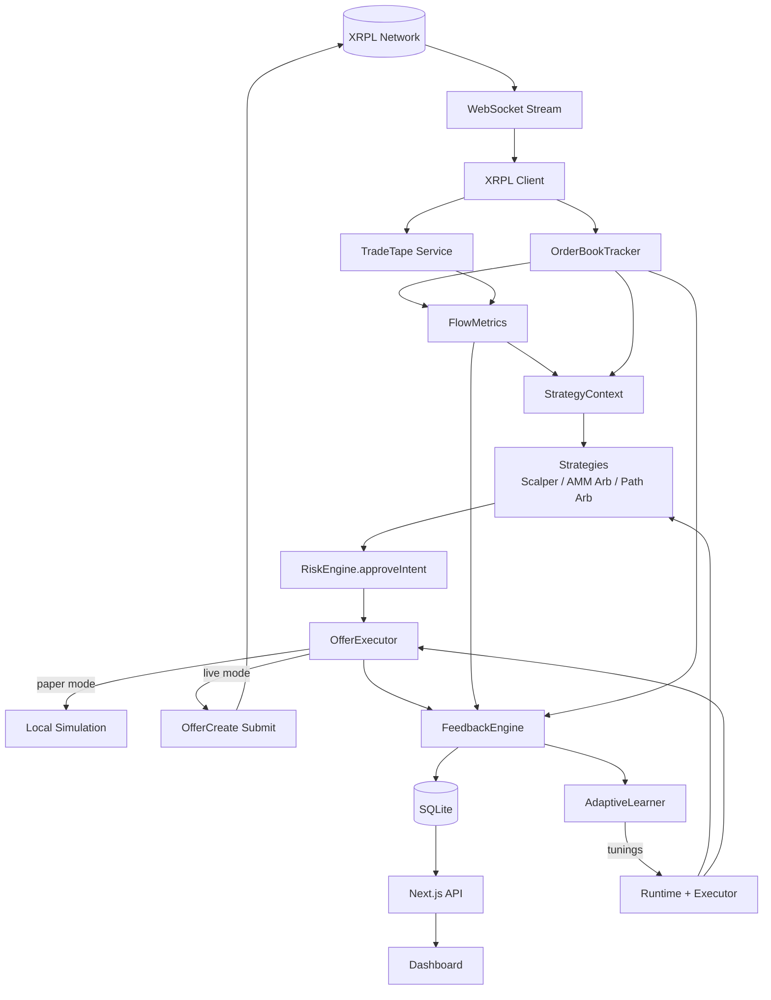

# XRPL Trading Bot

A localhost-only automated trading bot for the XRP Ledger decentralized exchange.

---

## Key Features

- **Three Strategies**: Order book scalping, AMM arbitrage, and path-finding arbitrage
- **Real-Time Flow Analysis**: Trade flow, depth imbalance, VWAP, and regime classification
- **Risk Management**: Daily loss limits, reserve floor, kill switch, circuit breakers
- **Execution Engine**: Paper/live modes, slippage protection, partial fill detection
- **Analytics**: SQLite-backed feedback engine with win rate, expectancy, drawdown, regime matrix
- **Adaptive Learning**: Bounded, explainable parameter tuning based on historical performance
- **Dashboard**: Next.js UI with charts, controls, risk panel, and real-time metrics
- **Security**: Localhost-only execution, cloud platform blocking, network mismatch protection

---

## Architecture Overview

| Component | File | Purpose |
|-----------|------|---------|
| Runtime | [src/runtime/tradingRuntime.ts](src/runtime/tradingRuntime.ts) | 4s tick loop, startup, shutdown |
| Order Book | [src/market/orderBookTracker.ts](src/market/orderBookTracker.ts) | Live bids/asks, spread, staleness |
| Trade Tape | [src/market/tradeTape.ts](src/market/tradeTape.ts) | Transaction stream processing |
| Flow Metrics | [src/market/flowMetrics.ts](src/market/flowMetrics.ts) | Signals, regimes, VWAP |
| Strategies | [src/strategies/](src/strategies/) | Scalper, AMM Arb, Path Arb |
| Risk Engine | [src/risk/riskEngine.ts](src/risk/riskEngine.ts) | Approvals, limits, kill switch |
| Executor | [src/execution/offerExecutor.ts](src/execution/offerExecutor.ts) | Paper/live execution |
| Feedback | [src/analytics/feedbackEngine.ts](src/analytics/feedbackEngine.ts) | Trade + market recording |
| Adaptive | [src/analytics/adaptiveLearner.ts](src/analytics/adaptiveLearner.ts) | Parameter tuning |
| Dashboard | [web/app/page.tsx](web/app/page.tsx) | Next.js UI |

---

## Data Flow



---

## Quickstart

```bash
git clone https://github.com/yourname/xrpl-trading-bot.git
cd xrpl-trading-bot
npm install
cp .env.example .env
# Edit .env with your configuration
npm run dev
```

Dashboard opens at **http://localhost:3000**

---

## Testnet Guide (Safe Mode)

```env
XRPL_NETWORK=testnet
XRPL_WSS_URL=wss://s.altnet.rippletest.net:51233
PAPER_TRADING=true
BOT_LOCAL_ONLY=true
```

```bash
npm run faucet              # Create funded testnet wallet
npm run fund:rlusd:testnet  # Add RLUSD trustline
npm run dev                 # Start bot + dashboard
```

Paper mode simulates trades locally—no transactions sent to XRPL.

---

## Mainnet Guide

> ⚠️ **WARNING**: Mainnet uses real XRP and tokens. You can lose money.

**Checklist before going live:**
- [ ] Tested extensively on testnet
- [ ] Set conservative risk limits
- [ ] Start with `PAPER_TRADING=true` on mainnet
- [ ] Validate paper results before enabling live

```env
XRPL_NETWORK=mainnet
XRPL_WSS_URL=wss://xrplcluster.com
XRPL_SEED=sYourMainnetSeed
PAPER_TRADING=true          # Start paper, switch to false when ready
BOT_LOCAL_ONLY=true
MAX_DAILY_LOSS_XRP=50
MAX_TRADE_SIZE=100
RESERVE_FLOOR_XRP=50
```

---

## Security Model

| Protection | Enforcement |
|------------|-------------|
| Localhost-only | CLI, Runtime, API middleware all verify 127.0.0.1 |
| Cloud blocking | Detects Vercel, AWS, GCP, Azure, Heroku, Railway, Render, Fly.io, DigitalOcean, Netlify, Kubernetes |
| Network mismatch | Blocks testnet wallet on mainnet and vice versa |
| Remote override | `BOT_ALLOW_REMOTE=true` required (loud warnings) |

---

## Risk Controls & Kill Switch

| Control | Trigger | Action |
|---------|---------|--------|
| Daily Loss Limit | `dailyLoss >= MAX_DAILY_LOSS_XRP` | Emergency shutdown |
| Consecutive Failures | 5+ failed trades | Emergency shutdown |
| Reserve Floor | Balance below `RESERVE_FLOOR_XRP` | Emergency shutdown |
| Issuer Blacklist | Trade with blacklisted issuer | Reject intent |
| Max Trade Size | Size exceeds `MAX_TRADE_SIZE` | Reject intent |
| Slippage Guard | Slippage > `MAX_SLIPPAGE_BPS` | Reject execution |
| Circuit Breaker | Path arb cumulative loss | Pause strategy |

Kill switch halts all trading immediately. Graceful shutdown cancels open offers.

---

## Analytics & Feedback DB

SQLite database at `data/feedback.sqlite` (WAL mode, 30-day retention).

**Tables:**
- `trade_events` — Every fill, cancel, rejection with prices, slippage, strategy
- `market_snapshots` — Order book state + flow metrics at trade time

**Computed Metrics:**
- Win rate, profit factor, expectancy
- Average slippage & edge (bps)
- Max drawdown
- Regime performance matrix

**API:** `GET /api/analytics/summary?hours=24&strategy=scalper`

---

## Adaptive Learning

Analyzes trade outcomes to tune strategy parameters within safe bounds.

**Scoring:** `score = avgNetEdgeBps - 0.5×slippage - 0.25×spread - 20×partialFillRate`

**Tunable Parameters:**
| Parameter | Range | Description |
|-----------|-------|-------------|
| sizeMultiplier | 0–1.5 | Position size scaling |
| maxSlippageBps | 10–150 | Slippage tolerance |
| minEdgeBpsToTrade | 0–30 | Minimum edge to enter |
| coolDownMs | 0–60000 | Pause between trades |
| disabledRegimes | array | Skip specific regimes |

**API:** `/api/analytics/adaptive/{state,recompute,toggle,explain}`

---

## Dashboard Overview

| Panel | Description |
|-------|-------------|
| Balance Banner | XRP + quote currency balances |
| Price Chart | Live candlestick chart |
| Controls | Start/stop, pair selection, position size |
| Risk Dashboard | Exposure meter, daily loss, kill switch status |
| Flow Metrics | Regime badge, imbalance gauge, VWAP |
| Analytics | Win rate, profit factor, regime matrix |
| Adaptive Learning | Tuning status, parameters, recompute |
| Trade Tape | Recent executions |
| Logs | Real-time event stream |

---

## Configuration Reference

### Core
| Variable | Default | Description |
|----------|---------|-------------|
| `XRPL_WSS_URL` | — | WebSocket endpoint |
| `XRPL_NETWORK` | `mainnet` | `mainnet` or `testnet` |
| `XRPL_SEED` | — | Wallet seed (secret) |
| `PAPER_TRADING` | `true` | Simulate trades |

### Security
| Variable | Default | Description |
|----------|---------|-------------|
| `BOT_LOCAL_ONLY` | `true` | Enforce localhost |
| `BOT_ALLOW_REMOTE` | `false` | Override (dangerous) |

### Risk
| Variable | Default | Description |
|----------|---------|-------------|
| `MAX_DAILY_LOSS_XRP` | `500` | Daily loss limit |
| `MAX_TRADE_SIZE` | `1000` | Max order size |
| `RESERVE_FLOOR_XRP` | `25` | Minimum balance |
| `POSITION_SIZE_XRP` | `5` | Trade size |
| `MAX_SLIPPAGE_BPS` | `50` | Slippage tolerance |

### Flow Metrics
| Variable | Default | Description |
|----------|---------|-------------|
| `FLOW_TRADE_WINDOW_MS` | `30000` | Trade lookback |
| `FLOW_QUIET_THRESHOLD` | `0.15` | Quiet regime threshold |
| `FLOW_TREND_THRESHOLD` | `0.4` | Trending threshold |
| `FLOW_CHAOTIC_THRESHOLD` | `0.7` | Chaotic threshold |

### Adaptive Learning
| Variable | Default | Description |
|----------|---------|-------------|
| `ADAPTIVE_LEARNING_ENABLED` | `true` | Enable tuning |
| `ADAPTIVE_LOOKBACK_HOURS` | `24` | Data window |
| `ADAPTIVE_MIN_SAMPLES` | `25` | Min trades before tuning |
| `ADAPTIVE_UPDATE_INTERVAL_MIN` | `15` | Update frequency |

---

## Troubleshooting

| Error | Solution |
|-------|----------|
| "Wallet network mismatch" | Use matching wallet for network |
| "Cloud platform detected" | Run on local machine only |
| "Order book stale" | Check WebSocket connection |
| "Reserve floor" | Add more XRP to wallet |
| "Kill switch triggered" | Review losses, restart bot |
| "Risk engine rejected" | Check position size and limits |

---

## Disclaimer

This software is provided "as is" without warranty. Trading cryptocurrencies involves substantial risk of loss. The authors are not responsible for any financial losses incurred. Use at your own risk. Always start with paper trading and small position sizes.
